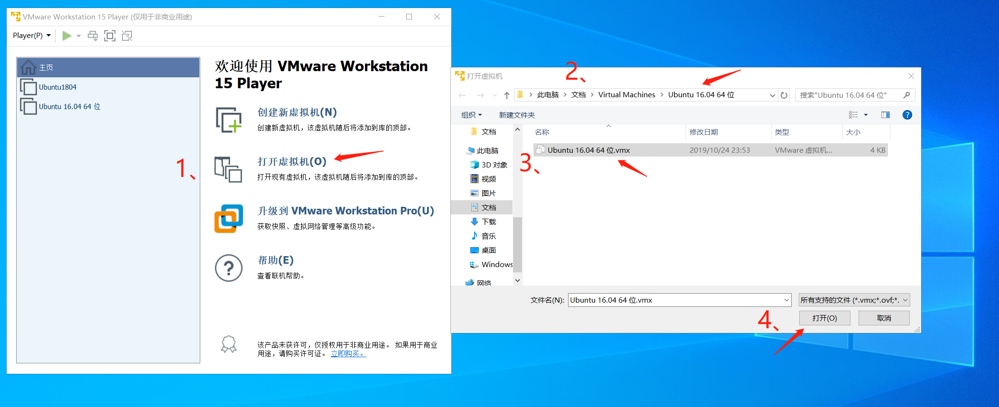

# 环境没有搭建好的可以使用这个
首先你要有 VMware Workstation 15 **Player** 这个软件，下载链接在这里：[VMware Player](./README.md#%e4%b8%8b%e8%bd%bd-vmware-player-%e4%bb%a5%e5%8f%8a-ubuntu-1604)

然后你从这里：

1. 下载好压缩包：

注意看大小是 4,836,181 KB，下载的时候要下全。

2. 解压缩得到 `Ubuntu 16.04 64 位/` 文件夹。注意该文件夹的路径。

3. 打开虚拟机：
   
   如上图，打开 VMware Player，然后依次点击打开虚拟机，找到第 2 的路径，选择对应的 vmx 文件，点击打开，即可打开虚拟机。

4. 用户名是 `flyq`，登录密码是 `test123`
5. 进入系统，就有了前几节课进行所需要的 `fabric` 环境

PS: 因为这个文件比较大，我上传就花了几个小时，所以下载的时候耐心点。