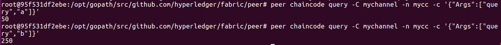
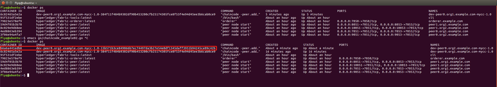

# Build Your First Network

## `Contents`
- [Build Your First Network](#build-your-first-network)
  - [`Contents`](#contents)
  - [1 生成公私钥和证书](#1-%e7%94%9f%e6%88%90%e5%85%ac%e7%a7%81%e9%92%a5%e5%92%8c%e8%af%81%e4%b9%a6)
    - [1.1 简介 cryptogen](#11-%e7%ae%80%e4%bb%8b-cryptogen)
    - [1.2 配置crypto-config.yaml](#12-%e9%85%8d%e7%bd%aecrypto-configyaml)
- [强调](#%e5%bc%ba%e8%b0%83)
    - [1.3 生成公私钥和证书](#13-%e7%94%9f%e6%88%90%e5%85%ac%e7%a7%81%e9%92%a5%e5%92%8c%e8%af%81%e4%b9%a6)
  - [2 生成创世区块和Channel配置区块](#2-%e7%94%9f%e6%88%90%e5%88%9b%e4%b8%96%e5%8c%ba%e5%9d%97%e5%92%8cchannel%e9%85%8d%e7%bd%ae%e5%8c%ba%e5%9d%97)
    - [2.1 介绍 configtxgen](#21-%e4%bb%8b%e7%bb%8d-configtxgen)
    - [2.2 配置configtx.yaml](#22-%e9%85%8d%e7%bd%aeconfigtxyaml)
    - [2.3生成创世区块](#23%e7%94%9f%e6%88%90%e5%88%9b%e4%b8%96%e5%8c%ba%e5%9d%97)
    - [2.4生成Channel配置tx文件](#24%e7%94%9f%e6%88%90channel%e9%85%8d%e7%bd%aetx%e6%96%87%e4%bb%b6)
  - [3 配置Fabric环境的docker-compose文件](#3-%e9%85%8d%e7%bd%aefabric%e7%8e%af%e5%a2%83%e7%9a%84docker-compose%e6%96%87%e4%bb%b6)
    - [3.1配置Orderer](#31%e9%85%8d%e7%bd%aeorderer)
    - [3.2 配置Peer](#32-%e9%85%8d%e7%bd%aepeer)
    - [3.3 配置CLI](#33-%e9%85%8d%e7%bd%aecli)
  - [4.初始化Fabric环境](#4%e5%88%9d%e5%a7%8b%e5%8c%96fabric%e7%8e%af%e5%a2%83)
    - [4.1启动Fabric环境的容器](#41%e5%90%af%e5%8a%a8fabric%e7%8e%af%e5%a2%83%e7%9a%84%e5%ae%b9%e5%99%a8)
    - [4.2创建Channel](#42%e5%88%9b%e5%bb%bachannel)
    - [4.3各个Peer加入Channel](#43%e5%90%84%e4%b8%aapeer%e5%8a%a0%e5%85%a5channel)
    - [4.4更新锚节点](#44%e6%9b%b4%e6%96%b0%e9%94%9a%e8%8a%82%e7%82%b9)
  - [5.链上代码的安装与运行](#5%e9%93%be%e4%b8%8a%e4%bb%a3%e7%a0%81%e7%9a%84%e5%ae%89%e8%a3%85%e4%b8%8e%e8%bf%90%e8%a1%8c)
    - [5.1Install ChainCode安装链上代码](#51install-chaincode%e5%ae%89%e8%a3%85%e9%93%be%e4%b8%8a%e4%bb%a3%e7%a0%81)
    - [5.2 Instantiate ChainCode 实例化链上代码](#52-instantiate-chaincode-%e5%ae%9e%e4%be%8b%e5%8c%96%e9%93%be%e4%b8%8a%e4%bb%a3%e7%a0%81)
    - [5.3在一个Peer上查询并发起交易](#53%e5%9c%a8%e4%b8%80%e4%b8%aapeer%e4%b8%8a%e6%9f%a5%e8%af%a2%e5%b9%b6%e5%8f%91%e8%b5%b7%e4%ba%a4%e6%98%93)
    - [5.4在另一个节点上查询交易](#54%e5%9c%a8%e5%8f%a6%e4%b8%80%e4%b8%aa%e8%8a%82%e7%82%b9%e4%b8%8a%e6%9f%a5%e8%af%a2%e4%ba%a4%e6%98%93)
  - [清理容器](#%e6%b8%85%e7%90%86%e5%ae%b9%e5%99%a8)
- [总结](#%e6%80%bb%e7%bb%93)


## 1 生成公私钥和证书
Fabric中有两种类型的公私钥和证书，一种是给节点之前通讯安全而准备的TLS证书，另一种是用户登录和权限控制的用户证书。这些证书本来应该是由CA来颁发，但是我们这里是测试环境，并没有启用CA节点，所以Fabric帮我们提供了一个工具：cryptogen。

### 1.1 简介 cryptogen
我们在第二节的搭建环境变量，下载了一组程序，并且放在了 fabric-samples/bin/ 目录下。我们可以直接用这个里面的 cryptogen。

开启终端进入到 `./fabric-samples/first-network$` 目录下

然后我们执行
```shell
./bin/cryptogen version
```
终端返回结果：
```shell
cryptogen:
 Version: 1.2.0
 Commit SHA: cae2ad4
 Go version: go1.10
 OS/Arch: linux/amd64
```


### 1.2 配置crypto-config.yaml
fabric-samples/first-network/crypto-config.yaml 已经提供了一个Orderer Org和两个Peer Org的配置，该模板中也对字段进行了注释。我们可以把Org2拿来分析一下：(用文本编辑器打开，查看即可，不需要改)

# 强调
**这里强调一下，这个文档就是第二节课环境搭建好了运行的那个脚本的具体步骤而已，因此，所有的配置(就是 .yaml 文件)，都是官方提供的那个默认的。不需要我们修改**


```yaml
- Name: Org2 
  Domain: org2.example.com 
  Template: 
    Count: 2 
  Users: 
    Count: 1
```

Name和Domain就是关于这个组织的名字和域名，这主要是用于生成证书的时候，证书内会包含该信息。而Template Count=2是说我们要生成2套公私钥和证书，一套是peer0.org2的，还有一套是peer1.org2的。最后Users. Count=1是说每个Template下面会有几个普通User（注意，Admin是Admin，不包含在这个计数中），这里配置了1，也就是说我们只需要一个普通用户User1@org2.example.com 我们可以根据实际需要调整这个配置文件，增删Org Users等。

这里，我们无需修改它。

### 1.3 生成公私钥和证书
我们配置好crypto-config.yaml文件后(其实默认的就是配置好了，我们只是查看了一下，知道有这么回事，不需要改)，就可以用cryptogen去读取该文件，并生成对应的公私钥和证书了：

我们先进入 `fabric-samples/first-network/` 文件夹，然后执行操作：
```shell
cd fabric-samples/first-network


sudo ../bin/cryptogen generate --config=./crypto-config.yaml
```
终端返回：
```shell
org1.example.com
org2.example.com
```
表示我们生成了两个组织需要的公私钥以及证书。
而且此时多了一个 crypto-config 的文件夹，公私钥和证书就保存在这里。
我们可以进入该文件夹查看生成了哪些文件：(如果之前没安装 tree,可以通过 `sudo apt install tree` 来安装)
```
tree crypto-config
```
## 2 生成创世区块和Channel配置区块
### 2.1 介绍 configtxgen
与前面1.1说到的类似，我们 fabric-samples/bin 文件夹下面已经有了 configtxgen 程序了。所以直接用它就行

我们先进入 `fabric-samples/first-network/` 文件夹，然后执行操作：

```shell
../bin/configtxgen --version
```
终端返回：
```shell
2019-10-22 02:15:03.067 PDT [common/tools/configtxgen] main -> WARN 001 Omitting the channel ID for configtxgen is deprecated.  Explicitly passing the channel ID will be required in the future, defaulting to 'testchainid'.
configtxgen:
 Version: 1.2.0
 Commit SHA: cae2ad4
 Go version: go1.10
 OS/Arch: linux/amd64
```

### 2.2 配置configtx.yaml
官方提供的fabric-samples/first-network/configtx.yaml这个文件里面配置了由2个Org参与的Orderer共识配置TwoOrgsOrdererGenesis，以及由2个Org参与的Channel配置：TwoOrgsChannel。Orderer可以设置共识的算法是Solo还是Kafka，以及共识时区块大小，超时时间等，我们使用默认值即可，不用更改。而Peer节点的配置包含了MSP的配置，锚节点的配置。如果我们有更多的Org，或者有更多的Channel，那么就可以根据模板进行对应的修改。

### 2.3生成创世区块
配置修改好后，我们就用 configtxgen 生成创世区块。并把这个区块保存到本地channel-artifacts文件夹中：
进入指定文件夹：
```shell
cd fabric-samples/first-network
```

此时发现 channel-artifacts/ 文件夹下面没有可见文件(因为执行下面这个命令没有返回东西)：
```shell
ls channel-artifacts/
```

生成创世区块：
```shell
 sudo ../bin/configtxgen -profile TwoOrgsOrdererGenesis -outputBlock ./channel-artifacts/genesis.block
```

终端返回的输出：
```shell
2019-10-22 02:20:28.219 PDT [common/tools/configtxgen] main -> WARN 001 Omitting the channel ID for configtxgen is deprecated.  Explicitly passing the channel ID will be required in the future, defaulting to 'testchainid'.
2019-10-22 02:20:28.219 PDT [common/tools/configtxgen] main -> INFO 002 Loading configuration
2019-10-22 02:20:28.229 PDT [common/tools/configtxgen/encoder] NewChannelGroup -> WARN 003 Default policy emission is deprecated, please include policy specificiations for the channel group in configtx.yaml
2019-10-22 02:20:28.230 PDT [common/tools/configtxgen/encoder] NewOrdererGroup -> WARN 004 Default policy emission is deprecated, please include policy specificiations for the orderer group in configtx.yaml
2019-10-22 02:20:28.230 PDT [common/tools/configtxgen/encoder] NewOrdererOrgGroup -> WARN 005 Default policy emission is deprecated, please include policy specificiations for the orderer org group OrdererOrg in configtx.yaml
2019-10-22 02:20:28.230 PDT [msp] getMspConfig -> INFO 006 Loading NodeOUs
2019-10-22 02:20:28.230 PDT [common/tools/configtxgen/encoder] NewOrdererOrgGroup -> WARN 007 Default policy emission is deprecated, please include policy specificiations for the orderer org group Org1MSP in configtx.yaml
2019-10-22 02:20:28.230 PDT [msp] getMspConfig -> INFO 008 Loading NodeOUs
2019-10-22 02:20:28.230 PDT [common/tools/configtxgen/encoder] NewOrdererOrgGroup -> WARN 009 Default policy emission is deprecated, please include policy specificiations for the orderer org group Org2MSP in configtx.yaml
2019-10-22 02:20:28.230 PDT [common/tools/configtxgen] doOutputBlock -> INFO 00a Generating genesis block
2019-10-22 02:20:28.232 PDT [common/tools/configtxgen] doOutputBlock -> INFO 00b Writing genesis block
```
查看 channel-artifacts 文件夹下面的内容：
```shell
ls channel-artifacts/
```
终端返回:
```shell
genesis.block
```
说明我们把创世区块成功执行设置好了。


### 2.4生成Channel配置tx文件
```shell
sudo ../bin/configtxgen -profile TwoOrgsChannel -outputCreateChannelTx ./channel-artifacts/channel.tx -channelID mychannel
```
终端返回：
```shell
2019-10-22 02:24:23.130 PDT [common/tools/configtxgen] main -> INFO 001 Loading configuration
2019-10-22 02:24:23.134 PDT [common/tools/configtxgen] doOutputChannelCreateTx -> INFO 002 Generating new channel configtx
2019-10-22 02:24:23.135 PDT [common/tools/configtxgen/encoder] NewApplicationGroup -> WARN 003 Default policy emission is deprecated, please include policy specificiations for the application group in configtx.yaml
2019-10-22 02:24:23.135 PDT [msp] getMspConfig -> INFO 004 Loading NodeOUs
2019-10-22 02:24:23.135 PDT [common/tools/configtxgen/encoder] NewApplicationOrgGroup -> WARN 005 Default policy emission is deprecated, please include policy specificiations for the application org group Org1MSP in configtx.yaml
2019-10-22 02:24:23.135 PDT [msp] getMspConfig -> INFO 006 Loading NodeOUs
2019-10-22 02:24:23.135 PDT [common/tools/configtxgen/encoder] NewApplicationOrgGroup -> WARN 007 Default policy emission is deprecated, please include policy specificiations for the application org group Org2MSP in configtx.yaml
2019-10-22 02:24:23.136 PDT [common/tools/configtxgen] doOutputChannelCreateTx -> INFO 008 Writing new channel tx
```
查看 channel-artifacts 文件夹下面的内容：
```shell
ls channel-artifacts/
```
终端返回:
```shell
channel.tx  genesis.block
```
说明刚刚成功生成 channel.tx


然后生成两个组织 Org1 以及 Org2 锚节点的 tx 文件，我们也需要使用这个程序来生成文件：
**生成Org1的：**
```shell
sudo ../bin/configtxgen -profile TwoOrgsChannel -outputAnchorPeersUpdate ./channel-artifacts/Org1MSPanchors.tx -channelID mychannel -asOrg Org1MSP
```
终端返回：
```shell
2019-10-22 02:28:19.541 PDT [common/tools/configtxgen] main -> INFO 001 Loading configuration
2019-10-22 02:28:19.555 PDT [common/tools/configtxgen] doOutputAnchorPeersUpdate -> INFO 002 Generating anchor peer update
2019-10-22 02:28:19.555 PDT [common/tools/configtxgen] doOutputAnchorPeersUpdate -> INFO 003 Writing anchor peer update
```
**生成 Org2 的：**
```shell
../bin/configtxgen -profile TwoOrgsChannel -outputAnchorPeersUpdate ./channel-artifacts/Org2MSPanchors.tx -channelID mychannel -asOrg Org2MSP
```
终端返回：
```shell
2019-10-22 02:30:09.102 PDT [common/tools/configtxgen] main -> INFO 001 Loading configuration
2019-10-22 02:30:09.107 PDT [common/tools/configtxgen] doOutputAnchorPeersUpdate -> INFO 002 Generating anchor peer update
2019-10-22 02:30:09.107 PDT [common/tools/configtxgen] doOutputAnchorPeersUpdate -> INFO 003 Writing anchor peer update
```


最终，我们在channel-artifacts文件夹中，应该是能够看到4个文件。

channel-artifacts/
├── channel.tx
├── genesis.block
├── Org1MSPanchors.tx
└── Org2MSPanchors.tx

## 3 配置Fabric环境的docker-compose文件
前面对节点和用户的公私钥以及证书，还有创世区块都生成完毕，接下来我们就可以配置docker-compose的yaml文件，启动Fabric的Docker环境了。

### 3.1配置Orderer
Orderer的配置是在 ./base/docker-compose-base.yaml里面，我们看看其中的内容(用编辑器打开可以查看)：
PS：这次我们看看就行，不需要动它们。

```yaml
orderer.example.com: 
  container_name: orderer.example.com 
  image: hyperledger/fabric-orderer 
  environment: 
    - ORDERER_GENERAL_LOGLEVEL=debug 
    - ORDERER_GENERAL_LISTENADDRESS=0.0.0.0 
    - ORDERER_GENERAL_GENESISMETHOD=file 
    - ORDERER_GENERAL_GENESISFILE=/var/hyperledger/orderer/orderer.genesis.block 
    - ORDERER_GENERAL_LOCALMSPID=OrdererMSP 
     - ORDERER_GENERAL_LOCALMSPDIR=/var/hyperledger/orderer/msp 
     # enabled TLS 
    - ORDERER_GENERAL_TLS_ENABLED=true 
    - ORDERER_GENERAL_TLS_PRIVATEKEY=/var/hyperledger/orderer/tls/server.key 
    - ORDERER_GENERAL_TLS_CERTIFICATE=/var/hyperledger/orderer/tls/server.crt 
    - ORDERER_GENERAL_TLS_ROOTCAS=[/var/hyperledger/orderer/tls/ca.crt] 
  working_dir: /opt/gopath/src/github.com/hyperledger/fabric 
  command: orderer 
  volumes: 
  - ../channel-artifacts/genesis.block:/var/hyperledger/orderer/orderer.genesis.block 
  - ../crypto-config/ordererOrganizations/example.com/orderers/orderer.example.com/msp:/var/hyperledger/orderer/msp 
  - ../crypto-config/ordererOrganizations/example.com/orderers/orderer.example.com/tls/:/var/hyperledger/orderer/tls 
  ports: 
    - 7050:7050
```

这里主要关心的是，ORDERER_GENERAL_GENESISFILE=/var/hyperledger/orderer/orderer.genesis.block，而这个创世区块就是我们之前创建的创世区块，这里就是Host(这里指我们的Ubuntu系统)到Docker(这里指等下运行的 Docker Orderer节点)的映射：

  - ../channel-artifacts/genesis.block:/var/hyperledger/orderer/orderer.genesis.block

另外的配置主要是TL，Log等，最后暴露出服务端口7050。

### 3.2 配置Peer
Peer的配置是在 ./base/docker-compose-base.yaml 和 peer-base.yaml里面，我们摘取其中的peer0.org1看看其中的内容：
同样看看就行，不需要动它。

```yaml
peer-base: 
  image: hyperledger/fabric-peer 
  environment: 
    - CORE_VM_ENDPOINT=unix:///host/var/run/docker.sock 
    # the following setting starts chaincode containers on the same 
    # bridge network as the peers 
    # https://docs.docker.com/compose/networking/ 
    - CORE_VM_DOCKER_HOSTCONFIG_NETWORKMODE=e2ecli_default 
    #- CORE_LOGGING_LEVEL=ERROR 
    - CORE_LOGGING_LEVEL=DEBUG 
    - CORE_PEER_TLS_ENABLED=true 
    - CORE_PEER_GOSSIP_USELEADERELECTION=true 
    - CORE_PEER_GOSSIP_ORGLEADER=false 
    - CORE_PEER_PROFILE_ENABLED=true 
    - CORE_PEER_TLS_CERT_FILE=/etc/hyperledger/fabric/tls/server.crt 
    - CORE_PEER_TLS_KEY_FILE=/etc/hyperledger/fabric/tls/server.key 
    - CORE_PEER_TLS_ROOTCERT_FILE=/etc/hyperledger/fabric/tls/ca.crt 
  working_dir: /opt/gopath/src/github.com/hyperledger/fabric/peer 
  command: peer node start

peer0.org1.example.com: 
  container_name: peer0.org1.example.com 
  extends: 
    file: peer-base.yaml 
    service: peer-base 
  environment: 
    - CORE_PEER_ID=peer0.org1.example.com 
    - CORE_PEER_ADDRESS=peer0.org1.example.com:7051 
    - CORE_PEER_CHAINCODELISTENADDRESS=peer0.org1.example.com:7052 
    - CORE_PEER_GOSSIP_EXTERNALENDPOINT=peer0.org1.example.com:7051 
    - CORE_PEER_LOCALMSPID=Org1MSP 
  volumes: 
      - /var/run/:/host/var/run/ 
      - ../crypto-config/peerOrganizations/org1.example.com/peers/peer0.org1.example.com/msp:/etc/hyperledger/fabric/msp 
      - ../crypto-config/peerOrganizations/org1.example.com/peers/peer0.org1.example.com/tls:/etc/hyperledger/fabric/tls 
  ports: 
    - 7051:7051 
     - 7052:7052 
    - 7053:7053
```

在Peer的配置中，主要是给Peer分配好各种服务的地址，以及TLS和MSP信息。

### 3.3 配置CLI
CLI在整个Fabric网络中扮演客户端的角色，我们在开发测试的时候可以用CLI来代替SDK，执行各种SDK能执行的操作。(第三节课我们讲了客户端 Client，可以看作使用者)CLI会和Peer相连，把指令发送给对应的Peer执行。CLI的配置在fabric-samples/first-network/docker-compose-cli.yaml中，我们看看其中的内容：

```yaml
cli: 
  container_name: cli 
  image: hyperledger/fabric-tools 
  tty: true 
  environment: 
    - GOPATH=/opt/gopath 
    - CORE_VM_ENDPOINT=unix:///host/var/run/docker.sock 
    - CORE_LOGGING_LEVEL=DEBUG 
    - CORE_PEER_ID=cli 
    - CORE_PEER_ADDRESS=peer0.org1.example.com:7051 
    - CORE_PEER_LOCALMSPID=Org1MSP 
    - CORE_PEER_TLS_ENABLED=true 
    - CORE_PEER_TLS_CERT_FILE=/opt/gopath/src/github.com/hyperledger/fabric/peer/crypto/peerOrganizations/org1.example.com/peers/peer0.org1.example.com/tls/server.crt 
    - CORE_PEER_TLS_KEY_FILE=/opt/gopath/src/github.com/hyperledger/fabric/peer/crypto/peerOrganizations/org1.example.com/peers/peer0.org1.example.com/tls/server.key 
    - CORE_PEER_TLS_ROOTCERT_FILE=/opt/gopath/src/github.com/hyperledger/fabric/peer/crypto/peerOrganizations/org1.example.com/peers/peer0.org1.example.com/tls/ca.crt 
    - CORE_PEER_MSPCONFIGPATH=/opt/gopath/src/github.com/hyperledger/fabric/peer/crypto/peerOrganizations/org1.example.com/users/Admin@org1.example.com/msp 
  working_dir: /opt/gopath/src/github.com/hyperledger/fabric/peer 
  command: /bin/bash
  volumes: 
      - /var/run/:/host/var/run/ 
      - ../chaincode/go/:/opt/gopath/src/github.com/hyperledger/fabric/examples/chaincode/go 
      - ./crypto-config:/opt/gopath/src/github.com/hyperledger/fabric/peer/crypto/ 
       - ./scripts:/opt/gopath/src/github.com/hyperledger/fabric/peer/scripts/ 
      - ./channel-artifacts:/opt/gopath/src/github.com/hyperledger/fabric/peer/channel-artifacts 
  depends_on: 
    - orderer.example.com 
    - peer0.org1.example.com 
    - peer1.org1.example.com 
    - peer0.org2.example.com 
    - peer1.org2.example.com 
```
从这里我们可以看到，CLI启动的时候默认连接的是peer0.org1.example.com，并且启用了TLS。默认是以Admin@org1.example.com这个身份连接到Peer的。CLI启动的时候，没有命令执行，因为 ` command: /bin/bash` 没有执行命令。`./scripts/script.sh `这个脚本也就是 fabric-samples/first-network/scripts/script.sh 这个脚本，这个脚本完成了Fabric环境的初始化和ChainCode的安装及运行，也就是接下来要讲的步骤4和5.在文件映射配置上，我们注意到`./../chaincode/:/opt/gopath/src/github.com/chaincode`，也就是说我们要安装的ChainCode都是在fabric-samples/chaincode目录下，以后我们要开发自己的ChainCode，只需要把我们的代码复制到该目录即可。


## 4.初始化Fabric环境
### 4.1启动Fabric环境的容器
确保我们在first-network文件夹下。
我们将整个Fabric Docker环境的配置放在docker-compose-cli.yaml后，只需要使用以下命令即可：
```shell
docker-compose -f docker-compose-cli.yaml up -d
```
终端输出:
```shell
Creating network "net_byfn" with the default driver
Creating volume "net_peer0.org2.example.com" with default driver
Creating volume "net_peer1.org2.example.com" with default driver
Creating volume "net_peer1.org1.example.com" with default driver
Creating volume "net_peer0.org1.example.com" with default driver
Creating volume "net_orderer.example.com" with default driver
Creating peer0.org2.example.com
Creating peer0.org1.example.com
Creating peer1.org2.example.com
Creating peer1.org1.example.com
Creating orderer.example.com
Creating cli
```

最后这个-d参数如果不加，那么当前终端就会一直附加在docker-compose上，而如果加上的话，那么docker容器就在后台运行。

运行docker ps命令可以看启动的结果：
```shell
CONTAINER ID        IMAGE                               COMMAND             CREATED              STATUS              PORTS                                              NAMES
95f531df2ebe        hyperledger/fabric-tools:latest     "/bin/bash"         About a minute ago   Up About a minute                                                      cli
79823e578ef9        hyperledger/fabric-orderer:latest   "orderer"           About a minute ago   Up About a minute   0.0.0.0:7050->7050/tcp                             orderer.example.com
59d4f05b3b70        hyperledger/fabric-peer:latest      "peer node start"   About a minute ago   Up About a minute   0.0.0.0:8051->7051/tcp, 0.0.0.0:8053->7053/tcp     peer1.org1.example.com
8c029e9d68ee        hyperledger/fabric-peer:latest      "peer node start"   About a minute ago   Up About a minute   0.0.0.0:10051->7051/tcp, 0.0.0.0:10053->7053/tcp   peer1.org2.example.com
4ed8863eb394        hyperledger/fabric-peer:latest      "peer node start"   About a minute ago   Up About a minute   0.0.0.0:7051->7051/tcp, 0.0.0.0:7053->7053/tcp     peer0.org1.example.com
3f06e94a4fa7        hyperledger/fabric-peer:latest      "peer node start"   About a minute ago   Up About a minute   0.0.0.0:9051->7051/tcp, 0.0.0.0:9053->7053/tcp     peer0.org2.example.com
```

可以看到1Orderer+4Peer+1CLI都启动了。

### 4.2创建Channel
现在我们要进入cli容器内部，在里面创建Channel。先用以下命令进入CLI内部Bash：
```shell
docker exec -it cli bash
```
然后计算机会显示我们进入 cli 的终端：
```shell
root@95f531df2ebe:/opt/gopath/src/github.com/hyperledger/fabric/peer# 
```

创建Channel的命令的模板是
```shell
peer channel create + 对应的参数
```
我们前面创建2.4创建Channel的配置区块时，指定了Channel的名字是mychannel，那么这里我们必须创建同样名字的Channel。
因此分条执行:
```shell
ORDERER_CA=/opt/gopath/src/github.com/hyperledger/fabric/peer/crypto/ordererOrganizations/example.com/orderers/orderer.example.com/msp/tlscacerts/tlsca.example.com-cert.pem

peer channel create -o orderer.example.com:7050 -c mychannel -f ./channel-artifacts/channel.tx --tls true --cafile $ORDERER_CA
```

执行该命令后，终端返回信息：
```shell
2019-10-22 11:07:20.664 UTC [channelCmd] InitCmdFactory -> INFO 001 Endorser and orderer connections initialized
2019-10-22 11:07:20.678 UTC [cli/common] readBlock -> INFO 002 Got status: &{NOT_FOUND}
2019-10-22 11:07:20.681 UTC [channelCmd] InitCmdFactory -> INFO 003 Endorser and orderer connections initialized
2019-10-22 11:07:20.891 UTC [cli/common] readBlock -> INFO 004 Received block: 0
```


系统会在cli内部的当前目录创建一个mychannel.block文件，这个文件非常重要，接下来其他节点要加入这个Channel就必须使用这个文件。

### 4.3各个Peer加入Channel
前面说过，我们CLI默认连接的是peer0.org1，那么我们要将这个Peer加入mychannel就很简单，只需要运行如下命令：

```shell
peer channel join -b mychannel.block
```
系统返回消息：

```shell
2019-10-22 11:09:02.778 UTC [channelCmd] InitCmdFactory -> INFO 001 Endorser and orderer connections initialized
2019-10-22 11:09:02.894 UTC [channelCmd] executeJoin -> INFO 002 Successfully submitted proposal to join channel
```

那么其他几个Peer又该怎么加入Channel呢？这里就需要修改CLI的环境变量，使其指向另外的Peer。比如我们要把peer1.org1加入mychannel，那么命令是：
先指定节点以及对应的证书等：
```shell
CORE_PEER_LOCALMSPID="Org1MSP" 
CORE_PEER_TLS_ROOTCERT_FILE=/opt/gopath/src/github.com/hyperledger/fabric/peer/crypto/peerOrganizations/org1.example.com/peers/peer0.org1.example.com/tls/ca.crt 
CORE_PEER_MSPCONFIGPATH=/opt/gopath/src/github.com/hyperledger/fabric/peer/crypto/peerOrganizations/org1.example.com/users/Admin@org1.example.com/msp 
CORE_PEER_ADDRESS=peer1.org1.example.com:7051
```
然后执行：
```shell
peer channel join -b mychannel.block
```
系统会返回成功加入Channel的消息:
```shell
2019-10-22 11:11:42.547 UTC [channelCmd] InitCmdFactory -> INFO 001 Endorser and orderer connections initialized
2019-10-22 11:11:42.649 UTC [channelCmd] executeJoin -> INFO 002 Successfully submitted proposal to join channel
```

同样的方法，将peer0.org2加入mychannel：
```shell
CORE_PEER_LOCALMSPID="Org2MSP" 
CORE_PEER_TLS_ROOTCERT_FILE=/opt/gopath/src/github.com/hyperledger/fabric/peer/crypto/peerOrganizations/org2.example.com/peers/peer0.org2.example.com/tls/ca.crt 
CORE_PEER_MSPCONFIGPATH=/opt/gopath/src/github.com/hyperledger/fabric/peer/crypto/peerOrganizations/org2.example.com/users/Admin@org2.example.com/msp 
CORE_PEER_ADDRESS=peer0.org2.example.com:7051
```
```shell
peer channel join -b mychannel.block
```
终端返回：
```shell
2019-10-22 11:13:16.864 UTC [channelCmd] InitCmdFactory -> INFO 001 Endorser and orderer connections initialized
2019-10-22 11:13:16.991 UTC [channelCmd] executeJoin -> INFO 002 Successfully submitted proposal to join channel
```

最后把peer1.org2加入mychannel：
```shell
CORE_PEER_LOCALMSPID="Org2MSP" 
CORE_PEER_TLS_ROOTCERT_FILE=/opt/gopath/src/github.com/hyperledger/fabric/peer/crypto/peerOrganizations/org2.example.com/peers/peer1.org2.example.com/tls/ca.crt 
CORE_PEER_MSPCONFIGPATH=/opt/gopath/src/github.com/hyperledger/fabric/peer/crypto/peerOrganizations/org2.example.com/users/Admin@org2.example.com/msp 
CORE_PEER_ADDRESS=peer1.org2.example.com:7051
```
```shell
peer channel join -b mychannel.block
```
终端返回：
```shell
2019-10-22 11:14:09.162 UTC [channelCmd] InitCmdFactory -> INFO 001 Endorser and orderer connections initialized
2019-10-22 11:14:09.265 UTC [channelCmd] executeJoin -> INFO 002 Successfully submitted proposal to join channel
```

### 4.4更新锚节点

对于Org1来说，peer0.org1是锚节点AnchorPeer，我们需要连接上它并更新锚节点：
此时终端仍然是 CLI docker 里面：
```shell
root@95f531df2ebe:/opt/gopath/src/github.com/hyperledger/fabric/peer# 
```

执行：
```shell
CORE_PEER_LOCALMSPID="Org1MSP" 
CORE_PEER_TLS_ROOTCERT_FILE=/opt/gopath/src/github.com/hyperledger/fabric/peer/crypto/peerOrganizations/org1.example.com/peers/peer0.org1.example.com/tls/ca.crt 
CORE_PEER_MSPCONFIGPATH=/opt/gopath/src/github.com/hyperledger/fabric/peer/crypto/peerOrganizations/org1.example.com/users/Admin@org1.example.com/msp 
CORE_PEER_ADDRESS=peer0.org1.example.com:7051
```
接着执行：
```shell
peer channel update -o orderer.example.com:7050 -c mychannel -f ./channel-artifacts/Org1MSPanchors.tx --tls true --cafile $ORDERER_CA
```
终端返回：
```shell
2019-10-22 11:17:12.315 UTC [channelCmd] InitCmdFactory -> INFO 001 Endorser and orderer connections initialized
2019-10-22 11:17:12.329 UTC [channelCmd] update -> INFO 002 Successfully submitted channel update
```

另外对于Org2，peer0.org2是锚节点，同样执行对应的更新代码：

```shell
CORE_PEER_LOCALMSPID="Org2MSP" 
CORE_PEER_TLS_ROOTCERT_FILE=/opt/gopath/src/github.com/hyperledger/fabric/peer/crypto/peerOrganizations/org2.example.com/peers/peer0.org2.example.com/tls/ca.crt 
CORE_PEER_MSPCONFIGPATH=/opt/gopath/src/github.com/hyperledger/fabric/peer/crypto/peerOrganizations/org2.example.com/users/Admin@org2.example.com/msp 
CORE_PEER_ADDRESS=peer0.org2.example.com:7051
```

接着执行：
```shell
peer channel update -o orderer.example.com:7050 -c mychannel -f ./channel-artifacts/Org2MSPanchors.tx --tls true --cafile $ORDERER_CA
```

输出：
```shell
2019-10-22 11:19:12.321 UTC [channelCmd] InitCmdFactory -> INFO 001 Endorser and orderer connections initialized
2019-10-22 11:19:12.332 UTC [channelCmd] update -> INFO 002 Successfully submitted channel update
```

## 5.链上代码的安装与运行
以上，整个Fabric网络和Channel都准备完毕，接下来我们来安装和运行ChainCode。这里仍然以最出名的Example02为例。这个例子实现了a，b两个账户，相互之间可以转账。

### 5.1Install ChainCode安装链上代码

链上代码的安装需要在各个相关的Peer上进行，对于我们现在这种Fabric网络，如果4个Peer都想对Example02进行操作，那么就需要安装4次。

仍然是保持在CLI的命令行下，现在我们的所在的路径是：
```shell
root@95f531df2ebe:/opt/gopath/src/github.com/hyperledger/fabric/peer# 
```
我们先切换到peer0.org1这个节点：
```shell
CORE_PEER_LOCALMSPID="Org1MSP" 
CORE_PEER_TLS_ROOTCERT_FILE=/opt/gopath/src/github.com/hyperledger/fabric/peer/crypto/peerOrganizations/org1.example.com/peers/peer0.org1.example.com/tls/ca.crt 
CORE_PEER_MSPCONFIGPATH=/opt/gopath/src/github.com/hyperledger/fabric/peer/crypto/peerOrganizations/org1.example.com/users/Admin@org1.example.com/msp 
CORE_PEER_ADDRESS=peer0.org1.example.com:7051
```
使用peer chaincode install命令可以安装指定的ChainCode并对其命名：
```shell
peer chaincode install -n mycc -v 1.0 -p github.com/chaincode/chaincode_example02/go
```
终端输出：
```shell
2019-10-22 11:38:40.738 UTC [chaincodeCmd] checkChaincodeCmdParams -> INFO 001 Using default escc
2019-10-22 11:38:40.738 UTC [chaincodeCmd] checkChaincodeCmdParams -> INFO 002 Using default vscc
2019-10-22 11:38:41.073 UTC [chaincodeCmd] install -> INFO 003 Installed remotely response:<status:200 payload:"OK" > 
```

安装的过程其实就是对CLI中指定的代码进行编译打包，并把打包好的文件发送到Peer，等待接下来的实例化。

其他节点由于暂时还没使用到，我们可以先不安装，等到了步骤5.4的时候再安装。

### 5.2 Instantiate ChainCode 实例化链上代码
实例化链上代码主要是在Peer所在的机器上对前面安装好的链上代码进行包装，生成对应Channel的Docker镜像和Docker容器。并且在实例化时我们可以指定背书策略。我们运行以下命令完成实例化：
执行：
```shell
ORDERER_CA=/opt/gopath/src/github.com/hyperledger/fabric/peer/crypto/ordererOrganizations/example.com/orderers/orderer.example.com/msp/tlscacerts/tlsca.example.com-cert.pem
```
接着执行：
```shell
peer chaincode instantiate  -C mychannel -o orderer.example.com:7050 --tls true --cafile $ORDERER_CA  -n mycc -v 1.0 -c '{"Args":["init","a","100","b","200"]}' -P "OR      ('Org1MSP.member','Org2MSP.member')"
```
这个终端输出：
```shell
2019-10-22 11:43:03.281 UTC [chaincodeCmd] checkChaincodeCmdParams -> INFO 001 Using default escc
2019-10-22 11:43:03.281 UTC [chaincodeCmd] checkChaincodeCmdParams -> INFO 002 Using default vscc
```


如果我们新开一个Ubuntu终端，去查看peer0.org1上的日志，那么就可以知道整个实例化的过程到底干了什么：
按照 Ctrl Alt t，打开新的终端

执行：
```shell
docker logs -f peer0.org1.example.com
```
这里终端将返回：
```shell
2019-10-22 11:00:03.463 UTC [msp] getMspConfig -> INFO 001 Loading NodeOUs
2019-10-22 11:00:03.476 UTC [nodeCmd] serve -> INFO 002 Starting peer:
 Version: 1.2.0
 Commit SHA: cae2ad4
 Go version: go1.10
 OS/Arch: linux/amd64
 Experimental features: false
 Chaincode:
  Base Image Version: 0.4.10
  Base Docker Namespace: hyperledger
  Base Docker Label: org.hyperledger.fabric
  Docker Namespace: hyperledger

2019-10-22 11:00:03.476 UTC [ledgermgmt] initialize -> INFO 003 Initializing ledger mgmt
2019-10-22 11:00:03.476 UTC [kvledger] NewProvider -> INFO 004 Initializing ledger provider
2019-10-22 11:00:03.637 UTC [kvledger] NewProvider -> INFO 005 ledger provider Initialized
2019-10-22 11:00:03.638 UTC [ledgermgmt] initialize -> INFO 006 ledger mgmt initialized
2019-10-22 11:00:03.638 UTC [peer] func1 -> INFO 007 Auto-detected peer address: 172.18.0.3:7051
2019-10-22 11:00:03.638 UTC [peer] func1 -> INFO 008 Returning peer0.org1.example.com:7051
2019-10-22 11:00:03.639 UTC [peer] func1 -> INFO 009 Auto-detected peer address: 172.18.0.3:7051
2019-10-22 11:00:03.639 UTC [peer] func1 -> INFO 00a Returning peer0.org1.example.com:7051
2019-10-22 11:00:03.641 UTC [nodeCmd] serve -> INFO 00b Starting peer with TLS enabled
2019-10-22 11:00:03.643 UTC [eventhub_producer] start -> INFO 00c Event processor started
2019-10-22 11:00:03.644 UTC [nodeCmd] computeChaincodeEndpoint -> INFO 00d Entering computeChaincodeEndpoint with peerHostname: peer0.org1.example.com
2019-10-22 11:00:03.645 UTC [nodeCmd] computeChaincodeEndpoint -> INFO 00e Exit with ccEndpoint: peer0.org1.example.com:7052
2019-10-22 11:00:03.645 UTC [nodeCmd] createChaincodeServer -> WARN 00f peer.chaincodeListenAddress is not set, using peer0.org1.example.com:7052
2019-10-22 11:00:03.649 UTC [sccapi] registerSysCC -> INFO 010 system chaincode cscc(github.com/hyperledger/fabric/core/scc/cscc) registered
2019-10-22 11:00:03.649 UTC [sccapi] registerSysCC -> INFO 011 system chaincode lscc(github.com/hyperledger/fabric/core/scc/lscc) registered
2019-10-22 11:00:03.650 UTC [sccapi] registerSysCC -> INFO 012 system chaincode qscc(github.com/hyperledger/fabric/core/scc/qscc) registered
2019-10-22 11:00:03.658 UTC [gossip/gossip] NewGossipService -> INFO 013 Creating gossip service with self membership of {peer0.org1.example.com:7051 [] [193 16 23 152 109 115 145 0 54 234 52 245 177 191 149 125 103 252 80 134 134 18 82 67 52 35 85 205 5 155 32 219] peer0.org1.example.com:7051 <nil> <nil>}
2019-10-22 11:00:03.658 UTC [gossip/gossip] start -> INFO 014 Gossip instance peer0.org1.example.com:7051 started
2019-10-22 11:00:03.660 UTC [cscc] Init -> INFO 015 Init CSCC
2019-10-22 11:00:03.660 UTC [sccapi] deploySysCC -> INFO 016 system chaincode cscc/(github.com/hyperledger/fabric/core/scc/cscc) deployed
2019-10-22 11:00:03.661 UTC [sccapi] deploySysCC -> INFO 017 system chaincode lscc/(github.com/hyperledger/fabric/core/scc/lscc) deployed
2019-10-22 11:00:03.663 UTC [qscc] Init -> INFO 018 Init QSCC
2019-10-22 11:00:03.663 UTC [sccapi] deploySysCC -> INFO 019 system chaincode qscc/(github.com/hyperledger/fabric/core/scc/qscc) deployed
2019-10-22 11:00:03.663 UTC [nodeCmd] serve -> INFO 01a Deployed system chaincodes
2019-10-22 11:00:03.665 UTC [discovery] NewService -> INFO 01b Created with config TLS: true, authCacheMaxSize: 1000, authCachePurgeRatio: 0.750000
2019-10-22 11:00:03.665 UTC [nodeCmd] registerDiscoveryService -> INFO 01c Discovery service activated
2019-10-22 11:00:03.665 UTC [nodeCmd] serve -> INFO 01d Starting peer with ID=[name:"peer0.org1.example.com" ], network ID=[dev], address=[peer0.org1.example.com:7051]
2019-10-22 11:00:03.666 UTC [nodeCmd] serve -> INFO 01e Started peer with ID=[name:"peer0.org1.example.com" ], network ID=[dev], address=[peer0.org1.example.com:7051]
2019-10-22 11:00:03.667 UTC [nodeCmd] func9 -> INFO 01f Starting profiling server with listenAddress = 0.0.0.0:6060
2019-10-22 11:00:06.661 UTC [gossip/discovery] func1 -> WARN 020 Could not connect to {peer1.org1.example.com:7051 [] [] peer1.org1.example.com:7051 <nil> <nil>} : context deadline exceeded
2019-10-22 11:00:08.667 UTC [gossip/gossip] func2 -> INFO 021 Learned of a new certificate: [10 7 79 114 103 49 77 83 80 18 170 6 45 45 45 45 45 66 69 71 73 78 32 67 69 82 84 73 70 73 67 65 84 69 45 45 45 45 45 10 77 73 73 67 75 84 67 67 65 99 43 103 65 119 73 66 65 103 73 82 65 78 53 51 104 103 43 109 111 115 107 74 55 121 102 108 54 119 88 78 50 121 111 119 67 103 89 73 75 111 90 73 122 106 48 69 65 119 73 119 99 122 69 76 10 77 65 107 71 65 49 85 69 66 104 77 67 86 86 77 120 69 122 65 82 66 103 78 86 66 65 103 84 67 107 78 104 98 71 108 109 98 51 74 117 97 87 69 120 70 106 65 85 66 103 78 86 66 65 99 84 68 86 78 104 98 105 66 71 10 99 109 70 117 89 50 108 122 89 50 56 120 71 84 65 88 66 103 78 86 66 65 111 84 69 71 57 121 90 122 69 117 90 88 104 104 98 88 66 115 90 83 53 106 98 50 48 120 72 68 65 97 66 103 78 86 66 65 77 84 69 50 78 104 10 76 109 57 121 90 122 69 117 90 88 104 104 98 88 66 115 90 83 53 106 98 50 48 119 72 104 99 78 77 84 107 120 77 68 73 121 77 68 103 49 78 106 81 50 87 104 99 78 77 106 107 120 77 68 69 53 77 68 103 49 78 106 81 50 10 87 106 66 113 77 81 115 119 67 81 89 68 86 81 81 71 69 119 74 86 85 122 69 84 77 66 69 71 65 49 85 69 67 66 77 75 81 50 70 115 97 87 90 118 99 109 53 112 89 84 69 87 77 66 81 71 65 49 85 69 66 120 77 78 10 85 50 70 117 73 69 90 121 89 87 53 106 97 88 78 106 98 122 69 78 77 65 115 71 65 49 85 69 67 120 77 69 99 71 86 108 99 106 69 102 77 66 48 71 65 49 85 69 65 120 77 87 99 71 86 108 99 106 69 117 98 51 74 110 10 77 83 53 108 101 71 70 116 99 71 120 108 76 109 78 118 98 84 66 90 77 66 77 71 66 121 113 71 83 77 52 57 65 103 69 71 67 67 113 71 83 77 52 57 65 119 69 72 65 48 73 65 66 78 110 76 54 101 52 90 69 75 75 71 10 112 57 120 80 101 82 108 76 51 67 87 87 73 87 111 103 43 106 88 70 77 77 49 51 67 104 48 56 56 76 86 51 100 56 102 88 49 114 51 106 52 121 54 82 122 110 122 72 79 115 90 73 79 47 78 98 102 117 52 116 76 103 51 103 10 110 110 72 111 115 121 88 72 121 55 113 106 84 84 66 76 77 65 52 71 65 49 85 100 68 119 69 66 47 119 81 69 65 119 73 72 103 68 65 77 66 103 78 86 72 82 77 66 65 102 56 69 65 106 65 65 77 67 115 71 65 49 85 100 10 73 119 81 107 77 67 75 65 73 65 86 65 82 71 86 69 85 82 117 50 121 65 120 79 54 75 114 79 72 52 105 102 117 104 52 105 49 66 87 117 112 83 102 86 118 82 113 110 43 65 55 48 77 65 111 71 67 67 113 71 83 77 52 57 10 66 65 77 67 65 48 103 65 77 69 85 67 73 81 68 90 113 102 65 57 89 71 68 83 117 47 109 78 66 76 66 48 56 113 113 68 78 105 66 122 71 118 114 105 77 83 101 112 52 120 56 98 68 117 53 53 118 81 73 103 86 67 52 118 10 87 65 105 121 65 103 68 102 83 100 81 104 100 69 89 71 68 80 53 113 100 97 72 84 111 107 79 73 74 47 97 109 66 77 105 88 54 54 85 61 10 45 45 45 45 45 69 78 68 32 67 69 82 84 73 70 73 67 65 84 69 45 45 45 45 45 10]
2019-10-22 11:09:02.790 UTC [ledgermgmt] CreateLedger -> INFO 022 Creating ledger [mychannel] with genesis block
2019-10-22 11:09:02.791 UTC [fsblkstorage] newBlockfileMgr -> INFO 023 Getting block information from block storage
2019-10-22 11:09:02.840 UTC [kvledger] CommitWithPvtData -> INFO 024 Channel [mychannel]: Committed block [0] with 1 transaction(s)
2019-10-22 11:09:02.840 UTC [pvtdatastorage] func1 -> INFO 025 Purger started: Purging expired private data till block number [0]
2019-10-22 11:09:02.841 UTC [pvtdatastorage] func1 -> INFO 026 Purger finished
2019-10-22 11:09:02.870 UTC [ledgermgmt] CreateLedger -> INFO 027 Created ledger [mychannel] with genesis block
2019-10-22 11:09:02.892 UTC [cscc] Init -> INFO 028 Init CSCC
2019-10-22 11:09:02.892 UTC [sccapi] deploySysCC -> INFO 029 system chaincode cscc/mychannel(github.com/hyperledger/fabric/core/scc/cscc) deployed
2019-10-22 11:09:02.893 UTC [sccapi] deploySysCC -> INFO 02a system chaincode lscc/mychannel(github.com/hyperledger/fabric/core/scc/lscc) deployed
2019-10-22 11:09:02.893 UTC [qscc] Init -> INFO 02b Init QSCC
2019-10-22 11:09:02.893 UTC [sccapi] deploySysCC -> INFO 02c system chaincode qscc/mychannel(github.com/hyperledger/fabric/core/scc/qscc) deployed
2019-10-22 11:09:08.897 UTC [gossip/election] beLeader -> INFO 02d [193 16 23 152 109 115 145 0 54 234 52 245 177 191 149 125 103 252 80 134 134 18 82 67 52 35 85 205 5 155 32 219] : Becoming a leader
2019-10-22 11:17:12.367 UTC [gossip/gossip] learnAnchorPeers -> INFO 02e Anchor peer with same endpoint, skipping connecting to myself
2019-10-22 11:17:12.453 UTC [kvledger] CommitWithPvtData -> INFO 02f Channel [mychannel]: Committed block [1] with 1 transaction(s)
2019-10-22 11:17:14.370 UTC [gossip/comm] authenticateRemotePeer -> WARN 030 Failed reading messge from 172.18.0.5:51770, reason: Timed out waiting for connection message from 172.18.0.5:51770
2019-10-22 11:17:14.370 UTC [gossip/comm] GossipStream -> ERRO 031 Authentication failed: Timed out waiting for connection message from 172.18.0.5:51770
2019-10-22 11:17:17.101 UTC [gossip/gossip] func2 -> INFO 032 Learned of a new certificate: [10 7 79 114 103 50 77 83 80 18 170 6 45 45 45 45 45 66 69 71 73 78 32 67 69 82 84 73 70 73 67 65 84 69 45 45 45 45 45 10 77 73 73 67 75 84 67 67 65 99 43 103 65 119 73 66 65 103 73 82 65 77 65 117 112 69 53 54 56 85 82 110 107 103 103 69 49 116 85 43 90 55 73 119 67 103 89 73 75 111 90 73 122 106 48 69 65 119 73 119 99 122 69 76 10 77 65 107 71 65 49 85 69 66 104 77 67 86 86 77 120 69 122 65 82 66 103 78 86 66 65 103 84 67 107 78 104 98 71 108 109 98 51 74 117 97 87 69 120 70 106 65 85 66 103 78 86 66 65 99 84 68 86 78 104 98 105 66 71 10 99 109 70 117 89 50 108 122 89 50 56 120 71 84 65 88 66 103 78 86 66 65 111 84 69 71 57 121 90 122 73 117 90 88 104 104 98 88 66 115 90 83 53 106 98 50 48 120 72 68 65 97 66 103 78 86 66 65 77 84 69 50 78 104 10 76 109 57 121 90 122 73 117 90 88 104 104 98 88 66 115 90 83 53 106 98 50 48 119 72 104 99 78 77 84 107 120 77 68 73 121 77 68 103 49 78 106 81 50 87 104 99 78 77 106 107 120 77 68 69 53 77 68 103 49 78 106 81 50 10 87 106 66 113 77 81 115 119 67 81 89 68 86 81 81 71 69 119 74 86 85 122 69 84 77 66 69 71 65 49 85 69 67 66 77 75 81 50 70 115 97 87 90 118 99 109 53 112 89 84 69 87 77 66 81 71 65 49 85 69 66 120 77 78 10 85 50 70 117 73 69 90 121 89 87 53 106 97 88 78 106 98 122 69 78 77 65 115 71 65 49 85 69 67 120 77 69 99 71 86 108 99 106 69 102 77 66 48 71 65 49 85 69 65 120 77 87 99 71 86 108 99 106 69 117 98 51 74 110 10 77 105 53 108 101 71 70 116 99 71 120 108 76 109 78 118 98 84 66 90 77 66 77 71 66 121 113 71 83 77 52 57 65 103 69 71 67 67 113 71 83 77 52 57 65 119 69 72 65 48 73 65 66 76 47 98 97 88 102 76 119 55 51 98 10 77 48 65 107 54 115 100 115 115 70 72 67 55 110 97 105 118 111 57 79 65 54 75 119 71 47 106 118 100 49 100 120 70 110 71 116 66 84 70 97 115 49 112 68 85 102 104 78 119 122 77 72 99 53 87 117 108 53 104 110 48 76 110 109 10 103 117 66 70 71 107 78 121 74 89 117 106 84 84 66 76 77 65 52 71 65 49 85 100 68 119 69 66 47 119 81 69 65 119 73 72 103 68 65 77 66 103 78 86 72 82 77 66 65 102 56 69 65 106 65 65 77 67 115 71 65 49 85 100 10 73 119 81 107 77 67 75 65 73 77 70 76 74 43 84 57 69 105 80 47 111 118 110 48 102 98 113 118 99 73 115 71 77 97 47 43 100 77 79 68 111 73 79 53 66 52 52 71 86 89 57 50 77 65 111 71 67 67 113 71 83 77 52 57 10 66 65 77 67 65 48 103 65 77 69 85 67 73 81 67 116 56 110 99 77 114 119 97 102 79 47 72 53 104 65 109 47 102 101 47 103 51 100 72 114 67 81 118 71 73 110 78 72 86 109 112 81 51 74 80 77 79 81 73 103 88 100 110 97 10 84 113 115 110 52 89 75 56 121 81 102 73 85 49 51 76 103 100 49 88 102 55 102 85 115 43 104 56 76 49 112 74 73 52 81 97 69 79 99 61 10 45 45 45 45 45 69 78 68 32 67 69 82 84 73 70 73 67 65 84 69 45 45 45 45 45 10]
2019-10-22 11:17:17.102 UTC [gossip/gossip] func2 -> INFO 033 Learned of a new certificate: [10 7 79 114 103 50 77 83 80 18 170 6 45 45 45 45 45 66 69 71 73 78 32 67 69 82 84 73 70 73 67 65 84 69 45 45 45 45 45 10 77 73 73 67 75 68 67 67 65 99 43 103 65 119 73 66 65 103 73 82 65 75 75 69 120 68 103 97 76 108 75 83 70 104 70 51 112 79 90 66 90 122 107 119 67 103 89 73 75 111 90 73 122 106 48 69 65 119 73 119 99 122 69 76 10 77 65 107 71 65 49 85 69 66 104 77 67 86 86 77 120 69 122 65 82 66 103 78 86 66 65 103 84 67 107 78 104 98 71 108 109 98 51 74 117 97 87 69 120 70 106 65 85 66 103 78 86 66 65 99 84 68 86 78 104 98 105 66 71 10 99 109 70 117 89 50 108 122 89 50 56 120 71 84 65 88 66 103 78 86 66 65 111 84 69 71 57 121 90 122 73 117 90 88 104 104 98 88 66 115 90 83 53 106 98 50 48 120 72 68 65 97 66 103 78 86 66 65 77 84 69 50 78 104 10 76 109 57 121 90 122 73 117 90 88 104 104 98 88 66 115 90 83 53 106 98 50 48 119 72 104 99 78 77 84 107 120 77 68 73 121 77 68 103 49 78 106 81 50 87 104 99 78 77 106 107 120 77 68 69 53 77 68 103 49 78 106 81 50 10 87 106 66 113 77 81 115 119 67 81 89 68 86 81 81 71 69 119 74 86 85 122 69 84 77 66 69 71 65 49 85 69 67 66 77 75 81 50 70 115 97 87 90 118 99 109 53 112 89 84 69 87 77 66 81 71 65 49 85 69 66 120 77 78 10 85 50 70 117 73 69 90 121 89 87 53 106 97 88 78 106 98 122 69 78 77 65 115 71 65 49 85 69 67 120 77 69 99 71 86 108 99 106 69 102 77 66 48 71 65 49 85 69 65 120 77 87 99 71 86 108 99 106 65 117 98 51 74 110 10 77 105 53 108 101 71 70 116 99 71 120 108 76 109 78 118 98 84 66 90 77 66 77 71 66 121 113 71 83 77 52 57 65 103 69 71 67 67 113 71 83 77 52 57 65 119 69 72 65 48 73 65 66 72 109 81 112 102 101 54 98 97 108 54 10 113 103 83 84 88 104 66 103 102 107 48 68 79 43 66 116 74 49 89 88 83 68 121 121 122 80 67 114 86 122 119 76 88 71 66 57 105 69 48 77 119 104 112 74 77 75 100 100 84 81 104 90 57 52 56 76 110 120 111 97 115 74 76 105 10 99 108 101 73 78 97 88 73 65 104 113 106 84 84 66 76 77 65 52 71 65 49 85 100 68 119 69 66 47 119 81 69 65 119 73 72 103 68 65 77 66 103 78 86 72 82 77 66 65 102 56 69 65 106 65 65 77 67 115 71 65 49 85 100 10 73 119 81 107 77 67 75 65 73 77 70 76 74 43 84 57 69 105 80 47 111 118 110 48 102 98 113 118 99 73 115 71 77 97 47 43 100 77 79 68 111 73 79 53 66 52 52 71 86 89 57 50 77 65 111 71 67 67 113 71 83 77 52 57 10 66 65 77 67 65 48 99 65 77 69 81 67 73 66 118 117 103 115 66 73 71 112 99 69 103 56 81 77 79 118 51 81 71 104 75 52 88 65 114 52 98 115 77 43 118 78 119 111 119 84 89 54 121 55 85 105 65 105 66 67 107 116 82 108 10 101 71 81 83 57 116 113 118 68 84 65 120 47 115 86 74 69 72 56 56 112 119 79 57 77 110 98 105 113 51 70 108 108 107 66 47 50 119 61 61 10 45 45 45 45 45 69 78 68 32 67 69 82 84 73 70 73 67 65 84 69 45 45 45 45 45 10]
2019-10-22 11:19:12.360 UTC [gossip/gossip] learnAnchorPeers -> INFO 034 Anchor peer with same endpoint, skipping connecting to myself
2019-10-22 11:19:12.408 UTC [kvledger] CommitWithPvtData -> INFO 035 Channel [mychannel]: Committed block [2] with 1 transaction(s)
2019-10-22 11:38:41.072 UTC [lscc] executeInstall -> INFO 036 Installed Chaincode [mycc] Version [1.0] to peer
2019-10-22 11:43:06.722 UTC [cceventmgmt] HandleStateUpdates -> INFO 037 Channel [mychannel]: Handling LSCC state update for chaincode [mycc]
2019-10-22 11:43:06.785 UTC [kvledger] CommitWithPvtData -> INFO 038 Channel [mychannel]: Committed block [3] with 1 transaction(s)

```

可以看出上面的日志就是各种初始化，验证，写账本之类的。总之完毕后，可以新打开第三个终端，使用`docker ps`可以看到有新的容器正在运行：
```shell
CONTAINER ID        IMAGE                                                                                                  COMMAND                  CREATED             STATUS              PORTS                                              NAMES
6c82465a5e2a        dev-peer0.org1.example.com-mycc-1.0-384f11f484b9302df90b453200cfb25174305fce8f53f4e94d45ee3b6cab0ce9   "chaincode -peer.add…"   5 minutes ago       Up 5 minutes                                                           dev-peer0.org1.example.com-mycc-1.0
95f531df2ebe        hyperledger/fabric-tools:latest                                                                        "/bin/bash"              About an hour ago   Up About an hour                                                       cli
79823e578ef9        hyperledger/fabric-orderer:latest                                                                      "orderer"                About an hour ago   Up About an hour    0.0.0.0:7050->7050/tcp                             orderer.example.com
59d4f05b3b70        hyperledger/fabric-peer:latest                                                                         "peer node start"        About an hour ago   Up About an hour    0.0.0.0:8051->7051/tcp, 0.0.0.0:8053->7053/tcp     peer1.org1.example.com
8c029e9d68ee        hyperledger/fabric-peer:latest                                                                         "peer node start"        About an hour ago   Up About an hour    0.0.0.0:10051->7051/tcp, 0.0.0.0:10053->7053/tcp   peer1.org2.example.com
4ed8863eb394        hyperledger/fabric-peer:latest                                                                         "peer node start"        About an hour ago   Up About an hour    0.0.0.0:7051->7051/tcp, 0.0.0.0:7053->7053/tcp     peer0.org1.example.com
3f06e94a4fa7        hyperledger/fabric-peer:latest                                                                         "peer node start"        About an hour ago   Up About an hour    0.0.0.0:9051->7051/tcp, 0.0.0.0:9053->7053/tcp     peer0.org2.example.com
```

### 5.3在一个Peer上查询并发起交易
现在链上代码的实例也有了，并且在实例化的时候指定了a账户100，b账户200，我们可以试着调用ChainCode的查询代码，验证一下，
我们先回到 CLI docker 容器那个终端，它前面提示符是这个：
```shell
root@95f531df2ebe:/opt/gopath/src/github.com/hyperledger/fabric/peer# 
```
然后查询a对应的余额，执行：
```shell
peer chaincode query -C mychannel -n mycc -c '{"Args":["query","a"]}'
```

返回结果：100，说明a有100单位的余额。

同理，查询b的：
```shell
peer chaincode query -C mychannel -n mycc -c '{"Args":["query","b"]}'
```
返回结果 200

接下来我们可以试着把a账户的50元转给b。对应的命令：
```shell
peer chaincode invoke -o orderer.example.com:7050  --tls true --cafile $ORDERER_CA -C mychannel -n mycc -c '{"Args":["invoke","a","b","50"]}'
```
终端返回：
```shell
2019-10-22 11:53:35.272 UTC [chaincodeCmd] chaincodeInvokeOrQuery -> INFO 001 Chaincode invoke successful. result: status:200 
```
表示成功执行。

如果细心观察第二个打开的终端，可以发现新多了一条 log：
```shell
2019-10-22 11:53:37.361 UTC [kvledger] CommitWithPvtData -> INFO 039 Channel [mychannel]: Committed block [4] with 1 transaction(s)
```

### 5.4在另一个节点上查询交易
前面的操作都是在org1下面做的，那么处于同一个区块链（同一个Channel下）的org2，是否会看org1的更改呢？我们试着给peer0.org2安装链上代码：
执行:
```shell
CORE_PEER_LOCALMSPID="Org2MSP" 
CORE_PEER_TLS_ROOTCERT_FILE=/opt/gopath/src/github.com/hyperledger/fabric/peer/crypto/peerOrganizations/org2.example.com/peers/peer0.org2.example.com/tls/ca.crt 
CORE_PEER_MSPCONFIGPATH=/opt/gopath/src/github.com/hyperledger/fabric/peer/crypto/peerOrganizations/org2.example.com/users/Admin@org2.example.com/msp 
CORE_PEER_ADDRESS=peer0.org2.example.com:7051
```
接着执行：
```shell
peer chaincode install -n mycc -v 1.0 -p github.com/chaincode/chaincode_example02/go
```
终端的返回：
```shell
2019-10-22 11:57:16.842 UTC [chaincodeCmd] checkChaincodeCmdParams -> INFO 001 Using default escc
2019-10-22 11:57:16.842 UTC [chaincodeCmd] checkChaincodeCmdParams -> INFO 002 Using default vscc
2019-10-22 11:57:17.010 UTC [chaincodeCmd] install -> INFO 003 Installed remotely response:<status:200 payload:"OK" > 
```

由于mycc已经在前面org1的时候实例化了，也就是说对应的区块已经生成了，所以在org2不能再次初始化。我们直接运行查询命令：
```
peer chaincode query -C mychannel -n mycc -c '{"Args":["query","a"]}'
```
这个时候我们发现运行该命令后要等很久（我这里花了5秒）才返回结果：

50

同样可以查询 b 的余额：

```shell
peer chaincode query -C mychannel -n mycc -c '{"Args":["query","b"]}'
```
返回结果：250

说明我们成功执行了一笔交易，将 50 单位从 a 转到 b。

这是因为peer0.org2也需要生成Docker镜像，创建对应的容器，才能通过容器返回结果。我们回到Ubuntu终端，执行docker ps，可以看到又多了一个容器：
```shell
CONTAINER ID        IMAGE                                                                                                  COMMAND                  CREATED              STATUS              PORTS                                              NAMES
b6a6a441edb8        dev-peer0.org2.example.com-mycc-1.0-15b571b3ce849066b7ec74497da3b27e54e0df1345daff3951b94245ce09c42b   "chaincode -peer.add…"   About a minute ago   Up About a minute                                                      dev-peer0.org2.example.com-mycc-1.0
6c82465a5e2a        dev-peer0.org1.example.com-mycc-1.0-384f11f484b9302df90b453200cfb25174305fce8f53f4e94d45ee3b6cab0ce9   "chaincode -peer.add…"   16 minutes ago       Up 16 minutes                                                          dev-peer0.org1.example.com-mycc-1.0
95f531df2ebe        hyperledger/fabric-tools:latest                                                                        "/bin/bash"              About an hour ago    Up About an hour                                                       cli
79823e578ef9        hyperledger/fabric-orderer:latest                                                                      "orderer"                About an hour ago    Up About an hour    0.0.0.0:7050->7050/tcp                             orderer.example.com
59d4f05b3b70        hyperledger/fabric-peer:latest                                                                         "peer node start"        About an hour ago    Up About an hour    0.0.0.0:8051->7051/tcp, 0.0.0.0:8053->7053/tcp     peer1.org1.example.com
8c029e9d68ee        hyperledger/fabric-peer:latest                                                                         "peer node start"        About an hour ago    Up About an hour    0.0.0.0:10051->7051/tcp, 0.0.0.0:10053->7053/tcp   peer1.org2.example.com
4ed8863eb394        hyperledger/fabric-peer:latest                                                                         "peer node start"        About an hour ago    Up About an hour    0.0.0.0:7051->7051/tcp, 0.0.0.0:7053->7053/tcp     peer0.org1.example.com
3f06e94a4fa7        hyperledger/fabric-peer:latest                                                                         "peer node start"        About an hour ago    Up About an hour    0.0.0.0:9051->7051/tcp, 0.0.0.0:9053->7053/tcp     peer0.org2.example.com
```

可以看出红框里面的docker容器是新增的。

## 清理容器
分条执行：
```shell
DOCKER_IMAGE_IDS=$(docker images | awk '($1 ~ /dev-peer.*/) {print $3}')


# 关闭删除容器
docker stop $(docker ps -q) & docker rm $(docker ps -aq)
# Cleanup images (清理新生成的链码镜像)
docker rmi -f $DOCKER_IMAGE_IDS
# remove orderer block and other channel configuration transactions and certs
sudo rm -rf channel-artifacts/*.block channel-artifacts/*.tx crypto-config ./org3-artifacts/crypto-config/ channel-artifacts/org3.json

```

# 总结
通过以上的分解，希望大家对Fabric环境的创建有了更深入的理解。我这里的示例仍然是官方的示例，并没有什么太新的东西。只要把这每一步搞清楚，那么接下来我们在生产环境创建更多的Org，创建大量的Channel，执行各种ChainCode都是如出一辙。