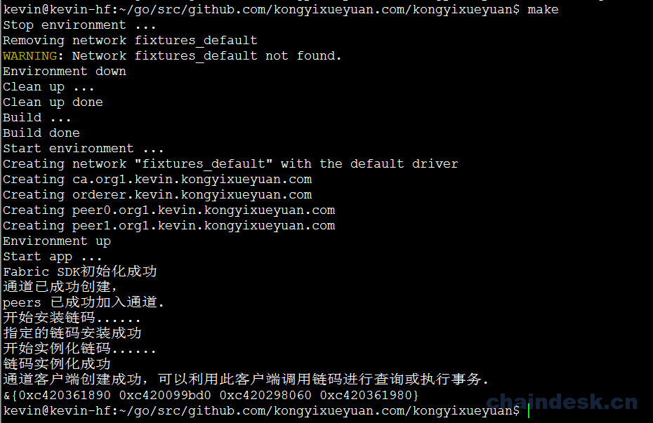

# 简单使用Fabric-SDK-Go


## 基础环境

此应用示例是只是为了帮助读者快速掌握使用 fabric-sdk-go 的方式与技巧。

在之前的内容中，我们详细的介绍了 Hyperledger Fabric 的系统架构及相关的组件。包括 Fabric 网络环境搭建，链码开发及测试及分布式账本数据的存储方式。所以我们不会在此项目详细解释 Hyperledger Fabric 的工作原理。在学习本项目之前，您应该通过要本书的前几章或通过Hyperledger Fabric 官网 或其它渠道学习并掌握 Hyperledger Fabric 的一些知识，以具备 Hyperledger Fabric 操作基础。

本应用实现是在基于 Ubuntu 16.04（推荐） 系统的基础上完成的，但 Hyperledger Fabric 与Mac OS X、Windows和其他Linux发行版相兼容。

### 所需环境及工具
```
Ubuntu 16.04
vim、git
docker 17.03.0-ce+
docker-compose 1.8+
Golang 1.10.x+(建议使用1.13及以上)
GoLang(建议使用，JetBrain全家桶)
```
### 配置Fabric－SDK


#### 创建config.yml文件
```
$ cd $GOPATH/src/github.com/surevil.com/surevil
$ vim config.yml
```
config.yml内容
```
name: "surevil-network"
#
# Schema version of the content. Used by the SDK to apply the corresponding parsing rules.
#
version: 1.0.0

#
# The client section used by GO SDK.
#
client:

  # Which organization does this application instance belong to? The value must be the name of an org
  # defined under "organizations"
  organization: Org1

  logging:
    level: info

  # Global configuration for peer, event service and orderer timeouts
  # if this this section is omitted, then default values will be used (same values as below)
#  peer:
#    timeout:
#      connection: 10s
#      response: 180s
#      discovery:
#        # Expiry period for discovery service greylist filter
#        # The channel client will greylist peers that are found to be offline
#        # to prevent re-selecting them in subsequent retries.
#        # This interval will define how long a peer is greylisted
#        greylistExpiry: 10s
#  eventService:
#    # Event service type (optional). If not specified then the type is automatically
#    # determined from channel capabilities.
#    type: (deliver|eventhub)
    # the below timeouts are commented out to use the default values that are found in
    # "pkg/fab/endpointconfig.go"
    # the client is free to override the default values by uncommenting and resetting
    # the values as they see fit in their config file
#    timeout:
#      connection: 15s
#      registrationResponse: 15s
#  orderer:
#    timeout:
#      connection: 15s
#      response: 15s
#  global:
#    timeout:
#      query: 180s
#      execute: 180s
#      resmgmt: 180s
#    cache:
#      connectionIdle: 30s
#      eventServiceIdle: 2m
#      channelConfig: 30m
#      channelMembership: 30s
#      discovery: 10s
#      selection: 10m

  # Root of the MSP directories with keys and certs.
  cryptoconfig:
    path: ${GOPATH}/src/github.com/surevil.com/surevil/fixtures/crypto-config

  # Some SDKs support pluggable KV stores, the properties under "credentialStore"
  # are implementation specific
  credentialStore:
    path: /tmp/surevil-store

    # [Optional]. Specific to the CryptoSuite implementation used by GO SDK. Software-based implementations
    # requiring a key store. PKCS#11 based implementations does not.
    cryptoStore:
      path: /tmp/surevil-msp

   # BCCSP config for the client. Used by GO SDK.
  BCCSP:
    security:
     enabled: true
     default:
      provider: "SW"
     hashAlgorithm: "SHA2"
     softVerify: true
     level: 256

  tlsCerts:
    # [Optional]. Use system certificate pool when connecting to peers, orderers (for negotiating TLS) Default: false
    systemCertPool: false

    # [Optional]. Client key and cert for TLS handshake with peers and orderers
    client:
      key:
        path:
      cert:
        path:

#
# [Optional]. But most apps would have this section so that channel objects can be constructed
# based on the content below. If an app is creating channels, then it likely will not need this
# section.
#
channels:
  # name of the channel
  parallelssurevil:
    # Required. list of orderers designated by the application to use for transactions on this
    # channel. This list can be a result of access control ("org1" can only access "ordererA"), or
    # operational decisions to share loads from applications among the orderers.  The values must
    # be "names" of orgs defined under "organizations/peers"
    # deprecated: not recommended, to override any orderer configuration items, entity matchers should be used.
    # orderers:
    #  - orderer.parallels.surevil.com

    # Required. list of peers from participating orgs
    peers:
      peer0.org1.parallels.surevil.com:
        # [Optional]. will this peer be sent transaction proposals for endorsement? The peer must
        # have the chaincode installed. The app can also use this property to decide which peers
        # to send the chaincode install request. Default: true
        endorsingPeer: true

        # [Optional]. will this peer be sent query proposals? The peer must have the chaincode
        # installed. The app can also use this property to decide which peers to send the
        # chaincode install request. Default: true
        chaincodeQuery: true

        # [Optional]. will this peer be sent query proposals that do not require chaincodes, like
        # queryBlock(), queryTransaction(), etc. Default: true
        ledgerQuery: true

        # [Optional]. will this peer be the target of the SDK's listener registration? All peers can
        # produce events but the app typically only needs to connect to one to listen to events.
        # Default: true
        eventSource: true

      peer1.org1.parallels.surevil.com:
        endorsingPeer: true
        chaincodeQuery: true
        ledgerQuery: true
        eventSource: true

    policies:
      #[Optional] options for retrieving channel configuration blocks
      queryChannelConfig:
        #[Optional] min number of success responses (from targets/peers)
        minResponses: 1
        #[Optional] channel config will be retrieved for these number of random targets
        maxTargets: 1
        #[Optional] retry options for query config block
        retryOpts:
          #[Optional] number of retry attempts
          attempts: 5
          #[Optional] the back off interval for the first retry attempt
          initialBackoff: 500ms
          #[Optional] the maximum back off interval for any retry attempt
          maxBackoff: 5s
          #[Optional] he factor by which the initial back off period is exponentially incremented
          backoffFactor: 2.0
      #[Optional] options for retrieving discovery info
      discovery:
        #[Optional] discovery info will be retrieved for these number of random targets
        maxTargets: 2
        #[Optional] retry options for retrieving discovery info
        retryOpts:
          #[Optional] number of retry attempts
          attempts: 4
          #[Optional] the back off interval for the first retry attempt
          initialBackoff: 500ms
          #[Optional] the maximum back off interval for any retry attempt
          maxBackoff: 5s
          #[Optional] he factor by which the initial back off period is exponentially incremented
          backoffFactor: 2.0
      #[Optional] options for the event service
      eventService:
        # [Optional] resolverStrategy specifies the peer resolver strategy to use when connecting to a peer
        # Possible values: [PreferOrg (default), MinBlockHeight, Balanced]
        #
        # PreferOrg:
        #   Determines which peers are suitable based on block height lag threshold, although will prefer the peers in the
        #   current org (as long as their block height is above a configured threshold). If none of the peers from the current org
        #   are suitable then a peer from another org is chosen.
        # MinBlockHeight:
        #   Chooses the best peer according to a block height lag threshold. The maximum block height of all peers is
        #   determined and the peers whose block heights are under the maximum height but above a provided "lag" threshold are load
        #   balanced. The other peers are not considered.
        # Balanced:
        #   Chooses peers using the configured balancer.
        resolverStrategy: PreferOrg
        # [Optional] balancer is the balancer to use when choosing a peer to connect to
        # Possible values: [Random (default), RoundRobin]
        balancer: Random
        # [Optional] blockHeightLagThreshold sets the block height lag threshold. This value is used for choosing a peer
        # to connect to. If a peer is lagging behind the most up-to-date peer by more than the given number of
        # blocks then it will be excluded from selection.
        # If set to 0 then only the most up-to-date peers are considered.
        # If set to -1 then all peers (regardless of block height) are considered for selection.
        # Default: 5
        blockHeightLagThreshold: 5
        # [Optional] reconnectBlockHeightLagThreshold - if >0 then the event client will disconnect from the peer if the peer's
        # block height falls behind the specified number of blocks and will reconnect to a better performing peer.
        # If set to 0 then this feature is disabled.
        # Default: 10
        # NOTES:
        #   - peerMonitorPeriod must be >0 to enable this feature
        #   - Setting this value too low may cause the event client to disconnect/reconnect too frequently, thereby
        #     affecting performance.
        reconnectBlockHeightLagThreshold: 10
        # [Optional] peerMonitorPeriod is the period in which the connected peer is monitored to see if
        # the event client should disconnect from it and reconnect to another peer.
        # Default: 0 (disabled)
        peerMonitorPeriod: 5s

#
# list of participating organizations in this network
#
organizations:
  Org1:
    mspid: org1.parallels.surevil.com
    cryptoPath: peerOrganizations/org1.parallels.surevil.com/users/{userName}@org1.parallels.surevil.com/msp
    peers:
      - peer0.org1.parallels.surevil.com
      - peer1.org1.parallels.surevil.com

    # [Optional]. Certificate Authorities issue certificates for identification purposes in a Fabric based
    # network. Typically certificates provisioning is done in a separate process outside of the
    # runtime network. Fabric-CA is a special certificate authority that provides a REST APIs for
    # dynamic certificate management (enroll, revoke, re-enroll). The following section is only for
    # Fabric-CA servers.
    certificateAuthorities:
      - ca.org1.parallels.surevil.com

#
# List of orderers to send transaction and channel create/update requests to. For the time
# being only one orderer is needed. If more than one is defined, which one get used by the
# SDK is implementation specific. Consult each SDK's documentation for its handling of orderers.
#
orderers:
  orderer.parallels.surevil.com:
    url: localhost:7050

    # these are standard properties defined by the gRPC library
    # they will be passed in as-is to gRPC client constructor
    grpcOptions:
      ssl-target-name-override: orderer.parallels.surevil.com
      # These parameters should be set in coordination with the keepalive policy on the server,
      # as incompatible settings can result in closing of connection.
      # When duration of the 'keep-alive-time' is set to 0 or less the keep alive client parameters are disabled
      keep-alive-time: 0s
      keep-alive-timeout: 20s
      keep-alive-permit: false
      fail-fast: false
      # allow-insecure will be taken into consideration if address has no protocol defined, if true then grpc or else grpcs
      allow-insecure: false

    tlsCACerts:
      # Certificate location absolute path
      path: ${GOPATH}/src/github.com/surevil.com/surevil/fixtures/crypto-config/ordererOrganizations/parallels.surevil.com/tlsca/tlsca.parallels.surevil.com-cert.pem

#
# List of peers to send various requests to, including endorsement, query
# and event listener registration.
#
peers:
  peer0.org1.parallels.surevil.com:
    # this URL is used to send endorsement and query requests
    url: localhost:7051
    # eventUrl is only needed when using eventhub (default is delivery service)
    eventUrl: localhost:7053

    grpcOptions:
      ssl-target-name-override: peer0.org1.parallels.surevil.com
      # These parameters should be set in coordination with the keepalive policy on the server,
      # as incompatible settings can result in closing of connection.
      # When duration of the 'keep-alive-time' is set to 0 or less the keep alive client parameters are disabled
      keep-alive-time: 0s
      keep-alive-timeout: 20s
      keep-alive-permit: false
      fail-fast: false
      # allow-insecure will be taken into consideration if address has no protocol defined, if true then grpc or else grpcs
      allow-insecure: false

    tlsCACerts:
      # Certificate location absolute path
      path: ${GOPATH}/src/github.com/surevil.com/surevil/fixtures/crypto-config/peerOrganizations/org1.parallels.surevil.com/tlsca/tlsca.org1.parallels.surevil.com-cert.pem

  peer1.org1.parallels.surevil.com:
    # this URL is used to send endorsement and query requests
    url: localhost:7151
    # eventUrl is only needed when using eventhub (default is delivery service)
    eventUrl: localhost:7153

    grpcOptions:
      ssl-target-name-override: peer1.org1.parallels.surevil.com
      # These parameters should be set in coordination with the keepalive policy on the server,
      # as incompatible settings can result in closing of connection.
      # When duration of the 'keep-alive-time' is set to 0 or less the keep alive client parameters are disabled
      keep-alive-time: 0s
      keep-alive-timeout: 20s
      keep-alive-permit: false
      fail-fast: false
      # allow-insecure will be taken into consideration if address has no protocol defined, if true then grpc or else grpcs
      allow-insecure: false

    tlsCACerts:
      # Certificate location absolute path
      path: ${GOPATH}/src/github.com/surevil.com/surevil/fixtures/crypto-config/peerOrganizations/org1.parallels.surevil.com/tlsca/tlsca.org1.parallels.surevil.com-cert.pem

#
# Fabric-CA is a special kind of Certificate Authority provided by Hyperledger Fabric which allows
# certificate management to be done via REST APIs. Application may choose to use a standard
# Certificate Authority instead of Fabric-CA, in which case this section would not be specified.
#
certificateAuthorities:
  ca.org1.parallels.surevil.com:
    url: http://localhost:7054
    tlsCACerts:
      # Certificate location absolute path
      path: ${GOPATH}/src/github.com/surevil.com/surevil/fixtures/crypto-config/peerOrganizations/org1.parallels.surevil.com/ca/ca.org1.parallels.surevil.com-cert.pem

    # Fabric-CA supports dynamic user enrollment via REST APIs. A "root" user, a.k.a registrar, is
    # needed to enroll and invoke new users.
    registrar:
      enrollId: admin
      enrollSecret: adminpw
    # [Optional] The optional name of the CA.
    caName: ca.org1.parallels.surevil.com

entityMatchers:
  peer:
    - pattern: (\w*)peer0.org1.parallels.surevil.com(\w*)
      urlSubstitutionExp: localhost:7051
      eventUrlSubstitutionExp: localhost:7053
      sslTargetOverrideUrlSubstitutionExp: peer0.org1.parallels.surevil.com
      mappedHost: peer0.org1.parallels.surevil.com

    - pattern: (\w*)peer1.org1.parallels.surevil.com(\w*)
      urlSubstitutionExp: localhost:7151
      eventUrlSubstitutionExp: localhost:7153
      sslTargetOverrideUrlSubstitutionExp: peer1.org1.parallels.surevil.com
      mappedHost: peer1.org1.parallels.surevil.com

  orderer:
    - pattern: (\w*)orderer.parallels.surevil.com(\w*)
      urlSubstitutionExp: localhost:7050
      sslTargetOverrideUrlSubstitutionExp: orderer.parallels.surevil.com
      mappedHost: orderer.parallels.surevil.com

  certificateAuthorities:
    - pattern: (\w*)ca.org1.parallels.surevil.com(\w*)
      urlSubstitutionExp: http://localhost:7054
      mappedHost: ca.org1.parallels.surevil.com
```

#### 定义所需结构体
配置文件完成指定的配置信息之后，我们开始编写代码。
在项目的根目录下添加一个名为 sdkInit 的新目录，我们将在这个文件夹中创建 SDK，并根据配置信息创建应用通道
为了方便管理 Hyperledger Fabric 网络环境，我们将在 sdkInit 目录中创建一个 fabricInitInfo.go 的源代码文件，用于定义一个结构体，包括 Fabric SDK 所需的各项相关信息
```
$ mkdir sdkInit
$ vim sdkInit/fabricInitInfo.go
```
fabricInitInfo.go 源代码：
```
package sdkInit

import (
    "github.com/hyperledger/fabric-sdk-go/pkg/client/resmgmt"
)

type InitInfo struct {
    ChannelID     string
    ChannelConfig string
    OrgName      string
    OrgAdmin       string
    OrdererOrgName    string
    OrgResMgmt *resmgmt.Client
}
```
结构体中包含成员解释如下：
- ChannelID：通道名称
- ChannelConfig：通道交易配置文件所在路径
- OrgName：组织名称
- OrgAdmin：组织管理员名称
- OrdererOrgName：Orderer名称
- OrgResMgmt：资源管理端实例

声明好结构体中的相应成员之后，就可以使用 fabric-sdk-go 相关的API来创建SDK实例，并使用该SDK实例进行一系列的操作，如：
- 创建通道
- 将组织中的peers加入已创建的通道中
- 安装链码
- 实例化链码
- 创建客户端实例

#### 创建SDK
首先，我们先来完成SDK的创建及通道的创建，通道创建完成之后，就可以将peers加入到该通道中。

在 sdkInit 目录下新创建一个名为 start.go 的源代码文件利用 vim 编辑器进行编辑：
```
import (
    "github.com/hyperledger/fabric-sdk-go/pkg/fabsdk"
    "github.com/hyperledger/fabric-sdk-go/pkg/core/config"
    "fmt"
    "github.com/hyperledger/fabric-sdk-go/pkg/client/resmgmt"
    mspclient "github.com/hyperledger/fabric-sdk-go/pkg/client/msp"
    "github.com/hyperledger/fabric-sdk-go/pkg/common/providers/msp"
    "github.com/hyperledger/fabric-sdk-go/pkg/common/errors/retry"

)

const ChaincodeVersion  = "1.0"

func SetupSDK(ConfigFile string, initialized bool) (*fabsdk.FabricSDK, error) {

    if initialized {
        return nil, fmt.Errorf("Fabric SDK已被实例化")
    }

    sdk, err := fabsdk.New(config.FromFile(ConfigFile))
    if err != nil {
        return nil, fmt.Errorf("实例化Fabric SDK失败: %v", err)
    }

    fmt.Println("Fabric SDK初始化成功")
    return sdk, nil
}

func CreateChannel(sdk *fabsdk.FabricSDK, info *InitInfo) error {

    clientContext := sdk.Context(fabsdk.WithUser(info.OrgAdmin), fabsdk.WithOrg(info.OrgName))
    if clientContext == nil {
        return fmt.Errorf("根据指定的组织名称与管理员创建资源管理客户端Context失败")
    }

    // New returns a resource management client instance.
    resMgmtClient, err := resmgmt.New(clientContext)
    if err != nil {
        return fmt.Errorf("根据指定的资源管理客户端Context创建通道管理客户端失败: %v", err)
    }

    // New creates a new Client instance
    mspClient, err := mspclient.New(sdk.Context(), mspclient.WithOrg(info.OrgName))
    if err != nil {
        return fmt.Errorf("根据指定的 OrgName 创建 Org MSP 客户端实例失败: %v", err)
    }

    //  Returns: signing identity
    adminIdentity, err := mspClient.GetSigningIdentity(info.OrgAdmin)
    if err != nil {
        return fmt.Errorf("获取指定id的签名标识失败: %v", err)
    }

    // SaveChannelRequest holds parameters for save channel request
    channelReq := resmgmt.SaveChannelRequest{ChannelID:info.ChannelID, ChannelConfigPath:info.ChannelConfig, SigningIdentities:[]msp.SigningIdentity{adminIdentity}}
    // save channel response with transaction ID
     _, err = resMgmtClient.SaveChannel(channelReq, resmgmt.WithRetry(retry.DefaultResMgmtOpts), resmgmt.WithOrdererEndpoint(info.OrdererOrgName))
    if err != nil {
        return fmt.Errorf("创建应用通道失败: %v", err)
    }

    fmt.Println("通道已成功创建，")

    info.OrgResMgmt = resMgmtClient

    // allows for peers to join existing channel with optional custom options (specific peers, filtered peers). If peer(s) are not specified in options it will default to all peers that belong to client's MSP.
    err = info.OrgResMgmt.JoinChannel(info.ChannelID, resmgmt.WithRetry(retry.DefaultResMgmtOpts), resmgmt.WithOrdererEndpoint(info.OrdererOrgName))
    if err != nil {
        return fmt.Errorf("Peers加入通道失败: %v", err)
    }

    fmt.Println("peers 已成功加入通道.")
    return nil
}
```

#### 编写测试代码
为了确保客户端能够初始化所有组件，将在启动网络的情况下进行简单的测试。 为了做到这一点，我们需要编写 Go 代码，在项目根目录下新创建一个 main.go 的主文件并编辑内容
```
$ cd $GOPATH/src/github.com/surevil.com/surevil
$ vim main.go
```
main.go源代码
```
package main

import (
    "os"
    "fmt"
    "github.com/surevil.com/surevil/sdkInit"
)

const (
    configFile = "config.yaml"
    initialized = false
    SimpleCC = "simplecc"
)

func main() {

    initInfo := &sdkInit.InitInfo{

        ChannelID: "parallelssurevil",
        ChannelConfig: os.Getenv("GOPATH") + "/src/github.com/surevil.com/surevil/fixtures/artifacts/channel.tx",

        OrgAdmin:"Admin",
        OrgName:"Org1",
        OrdererOrgName: "orderer.parallels.surevil.com",

    }

    sdk, err := sdkInit.SetupSDK(configFile, initialized)
    if err != nil {
        fmt.Printf(err.Error())
        return
    }

    defer sdk.Close()

    err = sdkInit.CreateChannel(sdk, initInfo)
    if err != nil {
        fmt.Println(err.Error())
        return
    }

}
```

### 满足依赖

#### 安装dep工具
govendor工具-1.13以前
go mod-1.13
go.mod

go mod init
go build
在运行应用程序之前，需要将 Go 源代码时行编译，但在开始编译之前，我们需要使用一个 vendor 目录来包含应用中所需的所有的依赖关系。 在我们的GOPATH中，我们有Fabric SDK Go和其他项目。 在尝试编译应用程序时，Golang 会在 GOPATH 中搜索依赖项，但首先会检查项目中是否存在vendor 文件夹。 如果项目中包含一个叫vendor的目录，Golang 将会从这个目录搜索依赖的包，就不会去检查 GOPATH 或 GOROOT。

Golang官方最初只提供了包管理的 go get 工具，它将下载的第三方包放到GOPATH的src目录下。但是项目一般由许多来源不同的第三包构成，所以在Golang1.5版本增加了一个新的发现包的方法，通过使用像dep这样的工具在vendor目录中来处理这些依赖关系。

将如下环境变量设置到用户的环境文件中(.bashrc)中

```
$ vim ~/.bashrc

export PATH=$PATH:$GOPATH/bin
```
执行 source 命令
```
$ source ~/.bashrc
```

在Golang的新版本中没有自动加入 dep 工具，所以需要开发人员自行安装该工具。
安装 dep 工具
```
$ go get -u github.com/golang/dep/cmd/dep
```

#### 下载所需依赖
dep 工具安装好之后我们来安装应用所需要的依赖
使用 dep 命令需要一个名为 Gopkg.toml 的配置文件指定依赖信息
创建一个名为Gopkg.toml的文件并编辑：
```
vim Gopkg.toml
```
Gopkg.toml内容
```
ignored = ["github.com/surevil.com/surevil/chaincode"]

[[constraint]]
  # Release v1.0.0-alpha4
  name = "github.com/hyperledger/fabric-sdk-go"
  revision = "a906355f73d060d7bf95874a9e90dc17589edbb3"
```
使用dep限制在 vendor 中指定希望SDK的特定版本。
保存该文件，然后执行 dep ensure 命令，该命令会自动将项目所需的依赖下载至当前的 vendor 目录中（下载依赖可能需要一段时间）：
```
dep ensure
```

#### 测试Fabric-SDK
所在依赖下载安装完成后，我们就可以进行测试
首先启动网络：
```
$ cd fixtures
$ docker-compose up -d
```
然后编译并运行：
```
$ cd ..
$ go build
$ ./surevil
```

#### 关闭网络并清理环境
测试成功之后即可以关闭Hypledger Fabric网络，但是我们在Fabric-SDK的配置文件config.yaml中指定了生成的密钥、证书的存储路径，关闭网络之后需要将其进行清理。
1）首先关闭处于启动状态的网络环境：
```
$ cd $GOPATH/src/github.com/surevil.com/surevil/fixtures 
$ docker-compose down
```
2）然后删除证书存储（由config.yaml配置文件中的client.credentialStore定义）：
```
$ rm -rf /tmp/surevil-*
```
3）最后删除一些不是由docker-compose命令生成的docker容器和docker镜像：
```
$ docker rm -f -v `docker ps -a --no-trunc | grep "surevil" | cut -d ' ' -f 1` 2>/dev/null
$ docker rmi `docker images --no-trunc | grep "surevil" | cut -d ' ' -f 1` 2>/dev/null
```

#### 利用Makefile简化步骤
由上面的步骤大家可以看出，启动网络及关闭并清理环境需要执行很多的命令（如进入目录、启动网络、构建、关闭网络、清理环境等等），为了方便测试，用一种方式来简化每次操作时的步骤，我们可以使用一个名为make的工具来实现，该工具的命令可以在一个步骤中自动完成所有的操作执行任务。具体实现方式如下：

安装 make 工具：
```
sudo apt install make
```

然后进入到项目的根目录下并创建一个名为 Makefile 的文件进行编辑：
```
$ cd $GOPATH/src/github.com/surevil.com/surevil
$ vim Makefile
```

Makefile内容
```
.PHONY: all dev clean build env-up env-down run

all: clean build env-up run

dev: build run

##### BUILD
build:
    @echo "Build ..."
    @dep ensure
    @go build
    @echo "Build done"

##### ENV
env-up:
    @echo "Start environment ..."
    @cd fixtures && docker-compose up --force-recreate -d
    @echo "Environment up"

env-down:
    @echo "Stop environment ..."
    @cd fixtures && docker-compose down
    @echo "Environment down"

##### RUN
run:
    @echo "Start app ..."
    @./surevil

##### CLEAN
clean: env-down
    @echo "Clean up ..."
    @rm -rf /tmp/surevil-* surevil
    @docker rm -f -v `docker ps -a --no-trunc | grep "surevil" | cut -d ' ' -f 1` 2>/dev/null || true
    @docker rmi `docker images --no-trunc | grep "surevil" | cut -d ' ' -f 1` 2>/dev/null || true
    @echo "Clean up done"
```
定义的Makefile文件可以执行完成如下步骤的任务：
1）使用make clean命令将关闭并清理Hyperledger Fabric整个网络环境；
2）使用make build命令将编译Golang应用程序；
3）使用make env-up命令将启动 Hyperledger Fabric网络环境；
4）使用make命令将启动应用程序并运行。
如果想直接启动项目，则可以使用 make 命令。该 make 命令执行顺序如上面的步骤所示。

### 链码实现
为了便于测试及简化代码，我们实现一个简单的链码功能，能够实现对分类账本中的数据进行设置（PutState（k，v））及相应的查询（GetState（k））功能即可。

#### 编写链码
在当前项目根目录中创建一个存放链码文件的 chaincode 目录，然后在该目录下创建一个 main.go 的文件并对其进行编辑
```
$ mkdir chaincode
$ vim chaincode/main.go
```
编写链码必须遵守链码开发的相关规定（详见第五章链码开发的相关内容），为此我们在链码文件中声明5个函数，如下：
- Init(stub shim.ChaincodeStubInterface) ：初始化链码或升级链码时被调用的函数
- Invoke(stub shim.ChaincodeStubInterface)：查询或更新操作分类账本状态时被调用的函数
- set(stub shim.ChaincodeStubInterface, args []string)：根据用户指定的Key与Value更新分类账本中的状态
- get(stub shim.ChaincodeStubInterface, args []string)：根据用户指定的Key从分类账本中查询状态
- main()：启动链码的主函数
main.go 文件内容如下：
```
package main

import (
    "github.com/hyperledger/fabric/core/chaincode/shim"
    "github.com/hyperledger/fabric/protos/peer"
    "fmt"
)

type SimpleChaincode struct {

} 

func (t *SimpleChaincode) Init(stub shim.ChaincodeStubInterface) peer.Response{

    return shim.Success(nil)
}

func (t *SimpleChaincode) Invoke(stub shim.ChaincodeStubInterface) peer.Response{
    fun, args := stub.GetFunctionAndParameters()

    var result string
    var err error
    if fun == "set"{
        result, err = set(stub, args)
    }else{
        result, err = get(stub, args)
    }
    if err != nil{
        return shim.Error(err.Error())
    }
    return shim.Success([]byte(result))
}

func set(stub shim.ChaincodeStubInterface, args []string)(string, error){

    if len(args) != 3{
        return "", fmt.Errorf("给定的参数错误")
    }

    err := stub.PutState(args[0], []byte(args[1]))
    if err != nil{
        return "", fmt.Errorf(err.Error())
    }

    err = stub.SetEvent(args[2], []byte{})
    if err != nil {
        return "", fmt.Errorf(err.Error())
    }

    return string(args[0]), nil

}

func get(stub shim.ChaincodeStubInterface, args []string)(string, error){
    if len(args) != 1{
        return "", fmt.Errorf("给定的参数错误")
    }
    result, err := stub.GetState(args[0])
    if err != nil{
        return "", fmt.Errorf("获取数据发生错误")
    }
    if result == nil{
        return "", fmt.Errorf("根据 %s 没有获取到相应的数据", args[0])
    }
    return string(result), nil

}

func main(){
    err := shim.Start(new(SimpleChaincode))
    if err != nil{
        fmt.Printf("启动SimpleChaincode时发生错误: %s", err)
    }
}
```

### 使用Fabric－SDK实现链码的自动部署

#### 编辑结构体
新建一个结构体，声明在 sdkInit/fabricInitInfo.go 文件中
```
$ vim sdkInit/fabricInitInfo.go
```
fabricInitInfo.go 文件完整内容如下：
```
package sdkInit

import (
    "github.com/hyperledger/fabric-sdk-go/pkg/client/resmgmt"
)

type InitInfo struct {
    ChannelID     string
    ChannelConfig string
    OrgAdmin      string
    OrgName       string
    OrdererOrgName    string
    OrgResMgmt *resmgmt.Client

    ChaincodeID    string
    ChaincodeGoPath    string
    ChaincodePath    string
    UserName    string
}
```
可以从上面的源代码中看到，在这个结构体中，我们新增加了与链码相关的如下成员：
- ChaincodeID：链码ID（即链码名称）
- ChaincodeGoPath：系统GOPATH路径
- ChaincodePath：链 码源代码所在路径
- UserName：组织用户名称

#### 使用Fabric-SDK安装及实例化链码
编辑 sdkInit/start.go 文件，利用Fabric-SDK提供的接口，对链码进行安装及实例化
```
$ vim sdkInit/start.go
```
在 start.go 文件中声明一个 InstallAndInstantiateCC 函数，该函数的主要功能有三项：
- 安装链码
- 实例化链码
- 创建客户端实例
在 start.go 文件中添加如下InstallAndInstantiateCC 函数内容并导入相应的package：
```
import (
    [......]

    "github.com/hyperledger/fabric-sdk-go/pkg/fab/ccpackager/gopackager"
    "github.com/hyperledger/fabric-sdk-go/third_party/github.com/hyperledger/fabric/common/cauthdsl"
    "github.com/hyperledger/fabric-sdk-go/pkg/client/channel"
)

// surevil
func InstallAndInstantiateCC(sdk *fabsdk.FabricSDK, info *InitInfo) (*channel.Client, error) {
    fmt.Println("开始安装链码......")
    // creates new go lang chaincode package
    ccPkg, err := gopackager.NewCCPackage(info.ChaincodePath, info.ChaincodeGoPath)
    if err != nil {
        return nil, fmt.Errorf("创建链码包失败: %v", err)
    }

    // contains install chaincode request parameters
    installCCReq := resmgmt.InstallCCRequest{Name: info.ChaincodeID, Path: info.ChaincodePath, Version: ChaincodeVersion, Package: ccPkg}
    // allows administrators to install chaincode onto the filesystem of a peer
    _, err = info.OrgResMgmt.InstallCC(installCCReq, resmgmt.WithRetry(retry.DefaultResMgmtOpts))
    if err != nil {
        return nil, fmt.Errorf("安装链码失败: %v", err)
    }

    fmt.Println("指定的链码安装成功")
    fmt.Println("开始实例化链码......")

    //  returns a policy that requires one valid
    ccPolicy := cauthdsl.SignedByAnyMember([]string{"org1.parallels.surevil.com"})

    instantiateCCReq := resmgmt.InstantiateCCRequest{Name: info.ChaincodeID, Path: info.ChaincodePath, Version: ChaincodeVersion, Args: [][]byte{[]byte("init")}, Policy: ccPolicy}
    // instantiates chaincode with optional custom options (specific peers, filtered peers, timeout). If peer(s) are not specified
    _, err = info.OrgResMgmt.InstantiateCC(info.ChannelID, instantiateCCReq, resmgmt.WithRetry(retry.DefaultResMgmtOpts))
    if err != nil {
        return nil, fmt.Errorf("实例化链码失败: %v", err)
    }

    fmt.Println("链码实例化成功")

    clientChannelContext := sdk.ChannelContext(info.ChannelID, fabsdk.WithUser(info.UserName), fabsdk.WithOrg(info.OrgName))
    // returns a Client instance. Channel client can query chaincode, execute chaincode and register/unregister for chaincode events on specific channel.
    channelClient, err := channel.New(clientChannelContext)
    if err != nil {
        return nil, fmt.Errorf("创建应用通道客户端失败: %v", err)
    }

    fmt.Println("通道客户端创建成功，可以利用此客户端调用链码进行查询或执行事务.")

    return channelClient, nil
}
```

#### 在main中调用
编辑 main.go 文件
```
$ vim main.go
```
main.go源码
```
package main

import (
    "os"
    "fmt"
    "github.com/surevil.com/surevil/sdkInit"
)

const (
    configFile = "config.yaml"
    initialized = false
    SimpleCC = "simplecc"
)

func main() {

    initInfo := &sdkInit.InitInfo{

        ChannelID: "parallelssurevil",
        ChannelConfig: os.Getenv("GOPATH") + "/src/github.com/surevil.com/surevil/fixtures/artifacts/channel.tx",

        OrgAdmin:"Admin",
        OrgName:"Org1",
        OrdererOrgName: "orderer.parallels.surevil.com",

        ChaincodeID: SimpleCC,
        ChaincodeGoPath: os.Getenv("GOPATH"),
        ChaincodePath: "github.com/surevil.com/surevil/chaincode/",
        UserName:"User1",
    }

    sdk, err := sdkInit.SetupSDK(configFile, initialized)
    if err != nil {
        fmt.Printf(err.Error())
        return
    }

    defer sdk.Close()

    err = sdkInit.CreateChannel(sdk, initInfo)
    if err != nil {
        fmt.Println(err.Error())
        return
    }

    channelClient, err := sdkInit.InstallAndInstantiateCC(sdk, initInfo)
    if err != nil {
        fmt.Println(err.Error())
        return
    }
    fmt.Println(channelClient)

}
```
#### 测试
```
make
```
输出如下：

在此，我们已经成功搭建了 Hyperledger Fabric 的网络环境，并通过 fabric-sdk-go 创建了应用通道，将peers加入通道，并在peer上安装、实例化了链码。那么如何在真正的应用程序中实现链码的调用，对分类账本中的状态进行操作，具体实现请参见下一章的内容。
