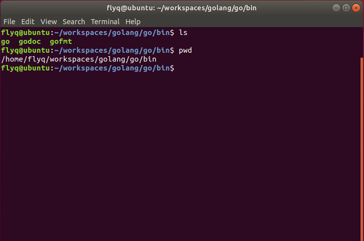
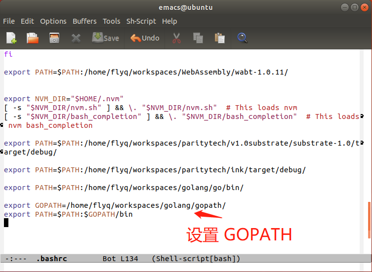
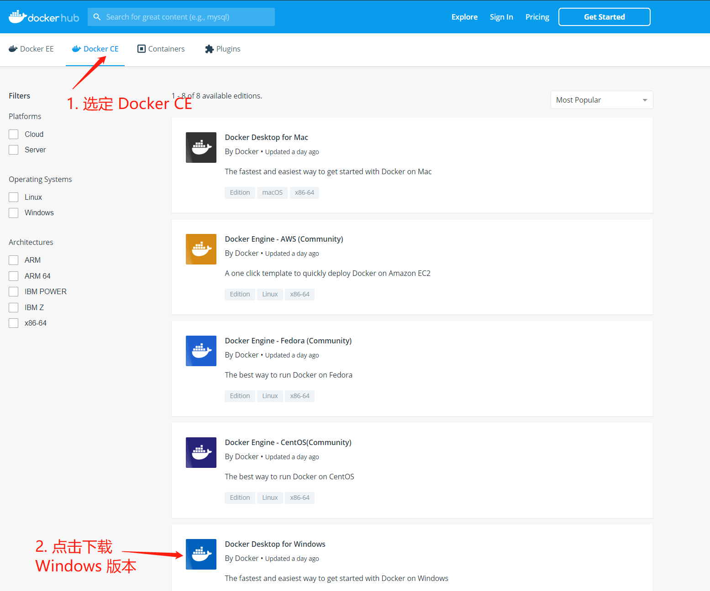
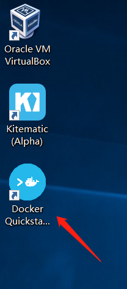

# `BTCU_Fabric`

## `Constents`
- [`BTCU_Fabric`](#btcufabric)
	- [`Constents`](#constents)
	- [0. `Fabric` 简介](#0-fabric-%e7%ae%80%e4%bb%8b)
		- [超级账本背景](#%e8%b6%85%e7%ba%a7%e8%b4%a6%e6%9c%ac%e8%83%8c%e6%99%af)
		- [`Fabric` 背景](#fabric-%e8%83%8c%e6%99%af)
		- [`Fabric` 架构简介](#fabric-%e6%9e%b6%e6%9e%84%e7%ae%80%e4%bb%8b)
	- [1. 开发环境搭建（Docker、Windows、Linux）](#1-%e5%bc%80%e5%8f%91%e7%8e%af%e5%a2%83%e6%90%ad%e5%bb%badockerwindowslinux)
		- [Docker 简介](#docker-%e7%ae%80%e4%bb%8b)
		- [Default 默认推荐方式](#default-%e9%bb%98%e8%ae%a4%e6%8e%a8%e8%8d%90%e6%96%b9%e5%bc%8f)
			- [这里我们统一环境：](#%e8%bf%99%e9%87%8c%e6%88%91%e4%bb%ac%e7%bb%9f%e4%b8%80%e7%8e%af%e5%a2%83)
		- [`Linux` 环境搭建](#linux-%e7%8e%af%e5%a2%83%e6%90%ad%e5%bb%ba)
			- [要求](#%e8%a6%81%e6%b1%82)
			- [下载 `VMware player` 以及 `Ubuntu 16.04`](#%e4%b8%8b%e8%bd%bd-vmware-player-%e4%bb%a5%e5%8f%8a-ubuntu-1604)
			- [安装 VMware Player 和 Ubuntu 16.04](#%e5%ae%89%e8%a3%85-vmware-player-%e5%92%8c-ubuntu-1604)
		- [`Linux` 下通过 `Docker` 安装：](#linux-%e4%b8%8b%e9%80%9a%e8%bf%87-docker-%e5%ae%89%e8%a3%85)
			- [更新软件源](#%e6%9b%b4%e6%96%b0%e8%bd%af%e4%bb%b6%e6%ba%90)
			- [安装 cURL:](#%e5%ae%89%e8%a3%85-curl)
			- [安装 `Golang`](#%e5%ae%89%e8%a3%85-golang)
			- [安装 `gopm`](#%e5%ae%89%e8%a3%85-gopm)
			- [安装 `Docker`](#%e5%ae%89%e8%a3%85-docker)
			- [安装 `Docker-compose`](#%e5%ae%89%e8%a3%85-docker-compose)
			- [通过脚本安装（推荐，因为下载的镜像更全更多，并且还会生成一个 `fabric-samples/` 文件夹，有一个示例）：](#%e9%80%9a%e8%bf%87%e8%84%9a%e6%9c%ac%e5%ae%89%e8%a3%85%e6%8e%a8%e8%8d%90%e5%9b%a0%e4%b8%ba%e4%b8%8b%e8%bd%bd%e7%9a%84%e9%95%9c%e5%83%8f%e6%9b%b4%e5%85%a8%e6%9b%b4%e5%a4%9a%e5%b9%b6%e4%b8%94%e8%bf%98%e4%bc%9a%e7%94%9f%e6%88%90%e4%b8%80%e4%b8%aa-fabric-samples-%e6%96%87%e4%bb%b6%e5%a4%b9%e6%9c%89%e4%b8%80%e4%b8%aa%e7%a4%ba%e4%be%8b)
		- [通过 `Windows` 下载 `Docker` 镜像来得到 `Fabric` 环境](#%e9%80%9a%e8%bf%87-windows-%e4%b8%8b%e8%bd%bd-docker-%e9%95%9c%e5%83%8f%e6%9d%a5%e5%be%97%e5%88%b0-fabric-%e7%8e%af%e5%a2%83)
			- [安装 Docker 环境](#%e5%ae%89%e8%a3%85-docker-%e7%8e%af%e5%a2%83)
			- [在 `Docker` 里下载定制好了的 `Fabric` 镜像：](#%e5%9c%a8-docker-%e9%87%8c%e4%b8%8b%e8%bd%bd%e5%ae%9a%e5%88%b6%e5%a5%bd%e4%ba%86%e7%9a%84-fabric-%e9%95%9c%e5%83%8f)
		- [`Linux` 环境下直接安装](#linux-%e7%8e%af%e5%a2%83%e4%b8%8b%e7%9b%b4%e6%8e%a5%e5%ae%89%e8%a3%85)
			- [安装其他环境：](#%e5%ae%89%e8%a3%85%e5%85%b6%e4%bb%96%e7%8e%af%e5%a2%83)
			- [安装 `Golang`](#%e5%ae%89%e8%a3%85-golang-1)
			- [安装 `gopm`](#%e5%ae%89%e8%a3%85-gopm-1)
			- [拉取 `Fabric` 源码](#%e6%8b%89%e5%8f%96-fabric-%e6%ba%90%e7%a0%81)
			- [编译安装 `peer` 组件：](#%e7%bc%96%e8%af%91%e5%ae%89%e8%a3%85-peer-%e7%bb%84%e4%bb%b6)
			- [编译安装 `fabric-order` 组件：](#%e7%bc%96%e8%af%91%e5%ae%89%e8%a3%85-fabric-order-%e7%bb%84%e4%bb%b6)
			- [编译安装 `fabric-ca` 组件](#%e7%bc%96%e8%af%91%e5%ae%89%e8%a3%85-fabric-ca-%e7%bb%84%e4%bb%b6)
			- [编译其他辅助工具：](#%e7%bc%96%e8%af%91%e5%85%b6%e4%bb%96%e8%be%85%e5%8a%a9%e5%b7%a5%e5%85%b7)
	- [2、案例运行与使用模拟](#2%e6%a1%88%e4%be%8b%e8%bf%90%e8%a1%8c%e4%b8%8e%e4%bd%bf%e7%94%a8%e6%a8%a1%e6%8b%9f)
		- [运行 `fabric-samples/` 里面的 `first-samples` 例子](#%e8%bf%90%e8%a1%8c-fabric-samples-%e9%87%8c%e9%9d%a2%e7%9a%84-first-samples-%e4%be%8b%e5%ad%90)
			- [生成必要组件](#%e7%94%9f%e6%88%90%e5%bf%85%e8%a6%81%e7%bb%84%e4%bb%b6)
			- [启动网络](#%e5%90%af%e5%8a%a8%e7%bd%91%e7%bb%9c)
			- [关闭网络](#%e5%85%b3%e9%97%ad%e7%bd%91%e7%bb%9c)
		- [自己启动 `Fabric` 网络](#%e8%87%aa%e5%b7%b1%e5%90%af%e5%8a%a8-fabric-%e7%bd%91%e7%bb%9c)
			- [网络拓扑](#%e7%bd%91%e7%bb%9c%e6%8b%93%e6%89%91)
			- [准备相关配置文件](#%e5%87%86%e5%a4%87%e7%9b%b8%e5%85%b3%e9%85%8d%e7%bd%ae%e6%96%87%e4%bb%b6)
				- [生成身份证书以及组织关系：](#%e7%94%9f%e6%88%90%e8%ba%ab%e4%bb%bd%e8%af%81%e4%b9%a6%e4%bb%a5%e5%8f%8a%e7%bb%84%e7%bb%87%e5%85%b3%e7%b3%bb)
				- [生成 `Ordering` 服务的创世区块](#%e7%94%9f%e6%88%90-ordering-%e6%9c%8d%e5%8a%a1%e7%9a%84%e5%88%9b%e4%b8%96%e5%8c%ba%e5%9d%97)
				- [生成新建应用通道的配置交易](#%e7%94%9f%e6%88%90%e6%96%b0%e5%bb%ba%e5%ba%94%e7%94%a8%e9%80%9a%e9%81%93%e7%9a%84%e9%85%8d%e7%bd%ae%e4%ba%a4%e6%98%93)
				- [生成锚节点配置更新文件](#%e7%94%9f%e6%88%90%e9%94%9a%e8%8a%82%e7%82%b9%e9%85%8d%e7%bd%ae%e6%9b%b4%e6%96%b0%e6%96%87%e4%bb%b6)
			- [启动 `Orderer` 节点](#%e5%90%af%e5%8a%a8-orderer-%e8%8a%82%e7%82%b9)

## 0. `Fabric` 简介

### 超级账本背景

超级账本(`Hyperledger`)项目是首个面向企业应用场景的开源分布式账本平台。

2015 年 12 月，由开源世界的旗舰组织 Linux 基金会牵头，30 家初始企业成员（包括 `IBM`、`Intel`、摩根大通、思科、`R3` 等），共同宣布了 `Hyperledger` 联合项目成立。超级账本项目为透明、公开、去中心化的企业级分布式账本技术提供开源参考实现，并推动区块链和分布式账本相关协议、规范和标准的发展。

作为一个联合项目(`collaborative project`)，超级账本由面向不同目的和场景的子项目构成。目前包括 `Fabric`、`Sawtooth`、`Iroha`、`Blockchain Explorer`、`Cello`、`Indy`、`Composer`、`Burrow` 等 8 大顶级项目。

这次课程将专注于 `Fabric`。

### `Fabric` 背景

`Fabric` 是最早加入到超级账本项目中的顶级项目，`Fabric `由 IBM、DAH 等企业于 2015 年底提交到社区。该项目的定位是面向企业的分布式账本平台，创新地引入了权限管理支持，设计上支持可插拔、可扩展，是首个面向联盟链场景的开源项目。
`Fabric` 基于 `Go` 语言实现，目前已经发布了 1.4 版本，同时包括 `Fabric CA`、`Fabric SDK`m等多个子项目。

`GitHub` 地址: https://github.com/hyperledger/fabric/

### `Fabric` 架构简介

4 种不同种类的服务节点：
* 背书节点（`Endorser`）：负责对交易的提案（`proposal`）进行检查和背书，计算交易执行结果；
* 确认节点（`Committer`）：负责在接受交易结果前再次检查合法性，接受合法交易对账本的修改，并写入区块链结构；
* 排序节点（`Order`）：对所有发往网络中的交易进行排序，将排序后的交易按照配置中的约定整理为区块，之后提交给确认节点进行处理；
* 证书节点（`CA`）：负责对网络中所有的证书进行管理，提供标准的 `PKI` 服务。

一笔交易的典型流程图：


2 种通道：
* 系统通道（`system channel`）唯一，独立。负责管理网络中的各种配置信息，并完成对其他应用通道（application channel）的创建。
* 应用通道（`application channel`）可以有多个。供用户发送交易使用。

启动一个 `Fabric` 网络的主要步骤：
1. 预备网络内各项配置，包括网络中成员的组织结构和对应的身份证书（使用 `cryptogen` 工具完成）；生成系统通道的初始配置区块文件，新建应用通道的配置更新交易文件以及可能需要的锚节点配置更新交易文件（使用 `configtxgen` 工具完成）。
2. 使用系统通道的初始配置区块文件启动排序节点，排序节点启动后自动按照指定配置创建系统通道。
3. 不同的组织按照预置角色分别启动 `Peer` 节点。这个时候网络不存在应用通道，`Peer` 节点也并没有加入网络中。
4. 使用新建应用通道的配置更新交易文件，向系统通道发送交易，创建新的应用通道。
5. 让对应的 `Peer` 节点加入所创建的应用通道中，此时 `Peer` 节点加入网络，可以转变接受交易了。
6. 用户通过客户端向网络中安装注册链码（`chaincode`），链码容器启动成功后用户即可对链码进行调用，将交易发送到网络中去。

## 1. 开发环境搭建（Docker、Windows、Linux）

### Docker 简介

[`Docker`](https://www.docker.com/) 是一类虚拟化技术，类似虚拟机，安装好 `Docker` 这个软件后，可以在 `Docker` 里面运行一些定制好了的镜像，比如今天我们用到的就是在 `Linux` 操作系统里安装了 `Fabric` 环境的镜像，这样就省去了直接安装 `Fabric` 的麻烦。更多的镜像可以参考 [`Docker Hub`](https://hub.docker.com/)。然后本身 Docker 这个软件支持 `Mac`、`Windows` 和 `Linux`，因此也是一个很好的跨平台工具。

### Default 默认推荐方式

下面有好几种环境，个人最推荐的是在 Linux 环境中通过下载对应 `Docker` 镜像来得到 `Fabric` 环境，这样坑最少。

#### 这里我们统一环境：
* Ubuntu 16.04 + Docker version 18.09.7 + Fabric 1.2.1

如果是 Mac，则只需在 `Mac` 下安装 Docker version 18.09.7 + Fabric 1.2.1

具体步骤：（如果是 `Mac` 系统，就跳过第 1 步）：  

1. [`Linux` 环境搭建](#linux-%e7%8e%af%e5%a2%83%e6%90%ad%e5%bb%ba)
2. [安装 `Docker`](#%e5%ae%89%e8%a3%85-docker)
3. [通过脚本安装（推荐，因为下载的镜像更多，并且还会生成一个 `fabric-samples/` 文件夹，有一个示例）：](#%e9%80%9a%e8%bf%87%e8%84%9a%e6%9c%ac%e5%ae%89%e8%a3%85%e6%8e%a8%e8%8d%90%e5%9b%a0%e4%b8%ba%e4%b8%8b%e8%bd%bd%e7%9a%84%e9%95%9c%e5%83%8f%e6%9b%b4%e5%a4%9a%e5%b9%b6%e4%b8%94%e8%bf%98%e4%bc%9a%e7%94%9f%e6%88%90%e4%b8%80%e4%b8%aa-fabric-samples-%e6%96%87%e4%bb%b6%e5%a4%b9%e6%9c%89%e4%b8%80%e4%b8%aa%e7%a4%ba%e4%be%8b)

### `Linux` 环境搭建

这里介绍通过在 `Windows` 操作系统下安装 `VMware player` 来得到 `Linux` 环境。
#### 要求
至少有 8G 内存（我曾在 4G 内存笔记本上安装虚拟机，开一个虚拟机然后开一个 Chrome 浏览器，基本电脑就很卡顿了）。如果没有 8G 内存的电脑，就去买一个阿里云或者腾讯云？学生还有优惠。或者用 Windows 10 的SubLinux 功能，自行搜索。

#### 下载 `VMware player` 以及 `Ubuntu 16.04`
下面有三种方式下载，看哪种快就用哪种。

官网：  
VMware Workstation 15.5.0 Player for Windows 64-bit Operating Systems:  
 https://my.vmware.com/en/web/vmware/free#desktop_end_user_computing/vmware_workstation_player/15_0  

Ubuntu 16.04:   
http://releases.ubuntu.com/16.04/ 选择 64-bit PC (AMD64) desktop image 版本（因为我的机器是 64 位，如果你的机器是 32 位系统，请下载 32 位的）。

百度云：  
链接: https://pan.baidu.com/s/1x-ZnaT1sbFRH5rQJWmfcog 提取码: nt38  
在 fabric course/software 文件夹下面

微云：  
链接：https://share.weiyun.com/52cMzs8 密码：hkf7mt

#### 安装 VMware Player 和 Ubuntu 16.04
就是一路点击下一步，安装好 VMware Player，然后启动 VMware Player，并创建虚拟机。可以参考 fabric course/安装虚拟机大概流程 里面的视频。视频在上面的百度云以及微云以及 [video](./video/) 里面都有。视频里面我说需要分配 60G 的磁盘空间，这是为了考虑这次课程结束以后，如果把这个虚拟机当中学习工作环境，可能还需要安装其他软件等等，所以给了它 60G。但是如果只是这次课程的话 20G 就足够了。
如果 C 盘的空间不够的话，如下图，可以点击 浏览，选择其他磁盘：


注意两点，一个是需要在 Boot 里面设置 Intel Vitual Technology；一个是尽量给 Ubuntu 分配大一点内存。这两个都在视频里面提到了。

### `Linux` 下通过 `Docker` 安装：


#### 更新软件源
分条执行
```shell
sudo apt update

sudo apt upgrade
```
#### 安装 cURL:
```shell
sudo apt install curl
```

#### 安装 `Golang`

从官网下载最新版本：
```shell
curl -O https://dl.google.com/go/go1.10.3.linux-amd64.tar.gz
```
解压：
```shell
tar -xvf go1.10.3.linux-amd64.tar.gz 
```
得到 `./go/` 文件夹：
```shell
$ ls go/
api      bin              CONTRIBUTORS  favicon.ico  LICENSE  PATENTS  README.md   src   VERSION
AUTHORS  CONTRIBUTING.md  doc           lib          misc     pkg      robots.txt  test
```
这个文件夹里面就有 go 语言的配套环境了，然后设置当前用户的环境变量。

用编辑器打开 ~/.bashrc 文件，比如我是用 gedit:
```shell
$ gedit ~/.bashrc
```
在最后一行添加：
```shell
export PATH=$PATH:/home/flyq/workspaces/golang/go/bin/
```
主要，添加的这行每个人的路径不同，因此这行代码也不同，如下图，需要根据自己电脑环境对应目录的路径得到：



然后保存好，更新一下：
```shell 
source ~/.bashrc
```

运行`go version`出现以下结果即表示安装成功：
```shell
$ go version 
go version go1.10.3 linux/amd64
```

最后设置一下 `GOPATH` 环境变量，同样是修改 `~/.bashrc` 文件：
创建一个新建目录（这里是 `/home/flyq/workspaces/golang/gopath/`），并指定它是 GOPATH，然后在这个目录下再创建三个文件夹，分别命名为：`src`, `pkg`, `bin`，最后添加这两行到 `~/.bashrc`下面，同样需要注意修改对应路径：
```.bashrc
export GOPATH=/home/flyq/workspaces/golang/gopath/
export PATH=$PATH:$GOPATH/bin/
```



然后保存好，更新一下：
```shell 
source ~/.bashrc
```
go 环境已经安装并配置好了。


#### 安装 `gopm`
注：如果你的终端环境能翻墙，这步跳过。
如果不能翻墙，那么就无法使用 `go get` 来获取对应的项目，这里推荐用 `gopm get` 来获取对于项目，因为它是无需翻墙的。

拉去 `gopm` 代码:
```shell
cd $GOPATH/src
mkdir -p github.com/gpmgo/
cd ./github.com/gpmgo
git clone https://github.com/gpmgo/gopm.git
cd ./gopm
go build
ls
```
然后可以看到会生成一个可执行文件 `gopm`，把它复制到 `$GOPATH/bin` 下面即可：
```shell
 cp ./gopm $GOPATH/bin
```

接下来你就可以在任意路径下使用 `gopm get` 来代替 `go get` 了。


#### 安装 `Docker`
打开一个终端（同时按下 Ctrl、Alt、t 这三个键）：
以下命令按条执行：
```shell
sudo apt update

sudo apt upgrade

sudo apt install docker.io

sudo systemctl start docker

sudo systemctl enable docker

docker --version
```
最后 `log`:
```shell
Docker version 18.09.7, build 2d0083d
```
运行:
```shell
docker images
```
如果报错：
```shell
Got permission denied while trying to connect to the Docker daemon socket at unix:///var/run/docker.sock: Get http://%2Fvar%2Frun%2Fdocker.sock/v1.39/images/json: dial unix /var/run/docker.sock: connect: permission denied
```
参考：
#### 安装 `Docker-compose`
```shell
sudo apt install docker-compose

docker-compose --version
```

#### 通过脚本安装（推荐，因为下载的镜像更全更多，并且还会生成一个 `fabric-samples/` 文件夹，有一个示例）：


参考：https://hyperledger-fabric.readthedocs.io/en/latest/install.html

这里需要注意一下，目前官方给的脚本使用的是 Fabric 1.4.3，而我们统一使用 1.2.1，因此直接用我修改了的脚本： [bootstrap.sh](./script/bootstrap.sh)，然后运行：
```shell
bash bootstrap.sh
```
最后 `log` 输出：
```shell
===> List out hyperledger docker images
hyperledger/fabric-tools         1.2.1               18ed4db0cd57        9 days ago          1.55GB
hyperledger/fabric-tools         latest              18ed4db0cd57        9 days ago          1.55GB
hyperledger/fabric-ca            1.2.1               c18a0d3cc958        9 days ago          253MB
hyperledger/fabric-ca            latest              c18a0d3cc958        9 days ago          253MB
hyperledger/fabric-ccenv         1.2.1               3d31661a812a        9 days ago          1.45GB
hyperledger/fabric-ccenv         latest              3d31661a812a        9 days ago          1.45GB
hyperledger/fabric-orderer       1.2.1               b666a6ebbe09        9 days ago          173MB
hyperledger/fabric-orderer       latest              b666a6ebbe09        9 days ago          173MB
hyperledger/fabric-peer          1.2.1               fa87ccaed0ef        9 days ago          179MB
hyperledger/fabric-peer          latest              fa87ccaed0ef        9 days ago          179MB
hyperledger/fabric-javaenv       1.2.1               5ba5ba09db8f        5 weeks ago         1.76GB
hyperledger/fabric-javaenv       latest              5ba5ba09db8f        5 weeks ago         1.76GB
hyperledger/fabric-zookeeper     0.4.15              20c6045930c8        5 months ago        1.43GB
hyperledger/fabric-zookeeper     latest              20c6045930c8        5 months ago        1.43GB
hyperledger/fabric-kafka         0.4.15              b4ab82bbaf2f        5 months ago        1.44GB
hyperledger/fabric-kafka         latest              b4ab82bbaf2f        5 months ago        1.44GB
hyperledger/fabric-couchdb       0.4.15              8de128a55539        5 months ago        1.5GB
hyperledger/fabric-couchdb       latest              8de128a55539        5 months ago        1.5GB
```
并且下面还会出现一个 `fabric-samples/` 文件夹。
到这里环境已经搭建好了。  


### 通过 `Windows` 下载 `Docker` 镜像来得到 `Fabric` 环境
这里最后有问题，而且是之前做的教程，Fabric 版本是 1.4.x，因此不推荐，仅作参考。

参考：https://docs.docker.com/docker-for-windows/install/  
（参考表示下面的具体安装文档是参考这个链接 + 实际情况得到的，因此一般来讲可以直接根据下面的步骤操作即可，下同）

#### 安装 Docker 环境

从官网这个[链接](https://hub.docker.com/search?q=&type=edition&offering=community)进去，然后下拉，找到 `Docker Desktop for Windows`，点击下载。


这里显示需要先登录：


如果之前有账户的直接登录，没有的就点击 `Sign Up`：


登录之后就可以直接下载了（建议把下载链接放在迅雷里面，在浏览器里面下载 10k 左右，迅雷里面 10M）：


安装时发现需要 `Windows 10` 的专业板或者企业版本：


然后查询发现本系统是家庭版：


因此需要安装 `docker-toolbox`:
在 https://github.com/docker/toolbox/releases ：


然后安装 docker toolbox 就是按照默认一路确认下去。过程中可能需要安装几个其他软件，同样都是确认。最后得到成功安装了的 Docker Quickstart:  


双击后启动 docker，这过程需要下载一个镜像，需要一些时间最后成功安装，运行 `docker --version` ，显示版本即成功安装 docker ：


总结：Windows 10 安装 Docker 有两种情况，如果版本是 Windows 10 专业版或者企业版，可以直接通过 `Docker for Windows Installer.exe` 安装，否则可以通过 `DockerToolbox-19.03.1.exe` 安装。

#### 在 `Docker` 里下载定制好了的 `Fabric` 镜像：

Fabric 有多个镜像，下面是对应的依赖关系：  
  

这里需要安装的是 `fabric-peer`, `fabric-orderer`, `fabric-ca`, `fabric-tools`, `fabric-ccenv`。  
更多的镜像参考：  
https://hub.docker.com/search?q=hyperledger&type=image 
  
以下命令直接下载对应 fabric 最新的镜像，也就是 fabric 1.4 版本。
```shell
docker pull hyperledger/fabric-peer \
    && docker pull hyperledger/fabric-orderer \
    && docker pull hyperledger/fabric-ca \
    && docker pull hyperledger/fabric-tools \
    && docker pull hyperledger/fabric-ccenv
```


下载完成后，用 `docker images` 查看，可以看到刚刚下载的 5 个镜像。
   
到这里，Windows 下的 Docker 环境配置好了

### `Linux` 环境下直接安装

#### 安装其他环境：
参考：https://hyperledger-fabric-cn.readthedocs.io/zh/latest/prereqs.html
其他都比较容易，按照步骤即可，下面就详细介绍 Golang 的安装。

#### 安装 `Golang`
从官网下载最新版本：
```shell
curl -O https://dl.google.com/go/go1.12.9.linux-amd64.tar.gz
```
解压：
```shell
tar -xvf go1.12.9.linux-amd64.tar.gz
```
得到 `./go/` 文件夹：
```shell
$ ls go/
api      bin              CONTRIBUTORS  favicon.ico  LICENSE  PATENTS  README.md   src   VERSION
AUTHORS  CONTRIBUTING.md  doc           lib          misc     pkg      robots.txt  test
```
这个文件夹里面就有 go 语言的配套环境了，然后设置当前用户的环境变量。

用编辑器打开 ~/.bashrc 文件，比如我是用 Emacs：
```shell
$ emacs ~/.bashrc
```
在最后一行添加：
```shell
export PATH=$PATH:/home/flyq/workspaces/golang/go/bin/
```
主要，添加的这行每个人的路径不同，因此这行代码也不同，如下图，需要根据自己电脑环境对应目录的路径得到：


然后保存好，更新一下：
```shell 
source ~/.bashrc
```

运行`go version`出现以下结果即表示安装成功：
```shell
$ go version 
go version go1.12.9 linux/amd64
```

最后设置一下 `GOPATH` 环境变量，同样是修改 `~/.bashrc` 文件：
创建一个新建目录（这里是 `/home/flyq/workspaces/golang/gopath/`），并指定它是 GOPATH，然后在这个目录下再创建三个文件夹，分别命名为：`src`, `pkg`, `bin`，最后添加这两行到 `~/.bashrc`下面，同样需要注意修改对应路径：
```.bashrc
export GOPATH=/home/flyq/workspaces/golang/gopath/
export PATH=$PATH:$GOPATH/bin
```


然后保存好，更新一下：
```shell 
source ~/.bashrc
```
go 环境已经安装并配置好了。


#### 安装 `gopm`
注：如果你的终端环境能翻墙，这步跳过。
如果不能翻墙，那么就无法使用 `go get` 来获取对应的项目，这里推荐用 `gopm get` 来获取对于项目，因为它是无需翻墙的。

拉去 `gopm` 代码:
```shell
cd $GOPATH/src
mkdir -p github.com/gpmgo/
cd ./github.com/gpmgo
git clone https://github.com/gpmgo/gopm.git
cd ./gopm
go build
ls
```
然后可以看到会生成一个可执行文件 `gopm`，把它复制到 `$GOPATH/bin` 下面即可：
```shell
 cp ./gopm $GOPATH/bin
```

接下来你就可以在任意路径下使用 `gopm get` 来代替 `go get` 了。


#### 拉取 `Fabric` 源码
```shell
gopm get -g  github.com/hyperledger/fabric
```
过一阵子 `fabric` 的源码就会被下载到 `$GOPATH/src/github.com/hyperledger/fabric/` 下面了


#### 编译安装 `peer` 组件：
```shell
cd $GOPATH/src/github.com/hyperledger/fabric/
make peer
```
最后 `log` 输出：
```shell
.build/bin/peer
CGO_CFLAGS=" " GOBIN=/home/flyq/workspaces/golang/gopath/src/github.com/hyperledger/fabric/.build/bin go install -tags "" -ldflags "-X github.com/hyperledger/fabric/common/metadata.Version=2.0.0 -X github.com/hyperledger/fabric/common/metadata.CommitSHA= -X github.com/hyperledger/fabric/common/metadata.BaseVersion=0.4.15 -X github.com/hyperledger/fabric/common/metadata.BaseDockerLabel=org.hyperledger.fabric -X github.com/hyperledger/fabric/common/metadata.DockerNamespace=hyperledger -X github.com/hyperledger/fabric/common/metadata.BaseDockerNamespace=hyperledger" github.com/hyperledger/fabric/cmd/peer
Binary available as .build/bin/peer
```
根据 `log` 得知编译好的 `peer` 二进制文件在 `./.build/bin/` 下面，把它复制到 `GOPATH/bin` 下即可：
```shell
cp .build/bin/peer $GOPATH/bin/
```
然后在任意目录下运行：
```shell
$ peer version
  peer:
  Version: 2.0.0
  Commit SHA: 
  Go version: go1.12.9
  OS/Arch: linux/amd64
  Chaincode:
    Base Docker Namespace: hyperledger
    Base Docker Label: org.hyperledger.fabric
    Docker Namespace: hyperledger

```

#### 编译安装 `fabric-order` 组件：
```shell
cd $GOPATH/src/github.com/hyperledger/fabric/
make orderer
```
`log`:
```shell
.build/bin/orderer
CGO_CFLAGS=" " GOBIN=/home/flyq/workspaces/golang/gopath/src/github.com/hyperledger/fabric/.build/bin go install -tags "" -ldflags "-X github.com/hyperledger/fabric/common/metadata.Version=2.0.0 -X github.com/hyperledger/fabric/common/metadata.CommitSHA= -X github.com/hyperledger/fabric/common/metadata.BaseVersion=0.4.15 -X github.com/hyperledger/fabric/common/metadata.BaseDockerLabel=org.hyperledger.fabric -X github.com/hyperledger/fabric/common/metadata.DockerNamespace=hyperledger -X github.com/hyperledger/fabric/common/metadata.BaseDockerNamespace=hyperledger" github.com/hyperledger/fabric/orderer
Binary available as .build/bin/orderer
```
同样把它移到 `$GOPATH/bin`
```shell
cp .build/bin/orderer $GOPATH/bin
```
验证是否安装成功：
```shell
$ orderer version
  orderer:
  Version: 2.0.0
  Commit SHA: 
  Go version: go1.12.9
  OS/Arch: linux/amd64
```

#### 编译安装 `fabric-ca` 组件
拉取 `fabric-ca` 代码：
```shell
gopm get -g github.com/hyperledger/fabric-ca
```
过一阵子代码就下载到了 `$GOPATH/src/github.com/hyperledger/fabric-ca/` 下面了，进入该目录，即可开始安装 `fabric-ca` 组件。
编译 `fabric-ca-server`:
```shell
cd $GOPATH/src/github.com/hyperledger/fabric-ca/
make fabric-ca-server
```
log:
```shell
Building fabric-ca-server in bin directory ...
Built bin/fabric-ca-server
```
复制到 `$GOPATH/bin/`：
```shell
cp ./bin/fabric-ca-server $GOPATH/bin
```
验证是否安装成功：
```shell
$ fabric-ca-server version
  fabric-ca-server:
  Version: 2.0.0-snapshot-
  Go version: go1.12.9
  OS/Arch: linux/amd64
```

同样安装 `fabric-ca-client`:
```shell
 make fabric-ca-client
```
后续步骤和安装 `fabric-ca-server` 相同。


#### 编译其他辅助工具：
`cryptogen`(用于生成组织机构和身份文件)、`configtxgen`(生成配置区块和配置交易)、`configtxlator`(解读配置信息)等：   

这里用 `configtxgen` 作为示例，其他的把对应名字改为 `cryptogen`/`configtxlator` 就 ok 了：

```shell
cd $GOPATH/src/github.com/hyperledger/fabric
make configtxgen
```
最后 `log` 输出是：
```shell
.build/bin/configtxgen
CGO_CFLAGS=" " GOBIN=/home/flyq/workspaces/golang/gopath/src/github.com/hyperledger/fabric/.build/bin go install -tags "" -ldflags "-X github.com/hyperledger/fabric/cmd/configtxgen/metadata.CommitSHA=" github.com/hyperledger/fabric/cmd/configtxgen
Binary available as .build/bin/configtxgen
```
表示成功编译。
执行 `./.build/bin/configtxgen --version` 会有以下输出:
```shell
configtxgen:
 Version: 2.0.0
 Commit SHA: development build
 Go version: go1.12.9
 OS/Arch: linux/amd64
```
这样，在 Linux 环境下安装好了 `Fabric` 对应环境。


## 2、案例运行与使用模拟

### 运行 `fabric-samples/` 里面的 `first-samples` 例子
参考：https://hyperledger-fabric-cn.readthedocs.io/zh/latest/build_network.html

如果是基于脚本安装的 Docker 环境，可以直接在脚本命令找到 `fabric-samples/` 文件夹。如果是其他途径安装的环境，直接运行：
```shell
gopm get -g github.com/hyperledger/fabric-samples

cd $GOPATH/src/github.com/hyperledger/fabric-samples
```
来下载 `fabric-samples/` 文件夹。   


不过如果仔细对比就会发现，如果是用脚本生成的，`fabric-samples` 下面多了一个 `/bin` 目录，里面有之前我们编译，安装的像 `peer` 等二进制可以执行文件:
```shell
ls ./fabric-samples/bin/
configtxgen    cryptogen  fabric-ca-client  orderer
configtxlator  discover   idemixgen         peer
```

#### 生成必要组件
```shell
ls

$ ./byfn.sh generate
Generating certs and genesis block for channel 'mychannel' with CLI timeout of '10' seconds and CLI delay of '3' seconds
Continue? [Y/n] y
proceeding ...
/home/flyq/workspaces/golang/gopath//bin/cryptogen # 注：可以看出，脚本里面调用的是我之前编译安装的，而不是 ./bin/ 目录下的

##########################################################
##### Generate certificates using cryptogen tool #########
##########################################################
+ cryptogen generate --config=./crypto-config.yaml
org1.example.com
org2.example.com
+ res=0
+ set +x

Generate CCP files for Org1 and Org2
/home/flyq/workspaces/golang/gopath//bin/configtxgen
##########################################################
#########  Generating Orderer Genesis block ##############
##########################################################
2019-09-05 19:43:08.978 PDT [common.tools.configtxgen] main -> INFO 001 Loading configuration
2019-09-05 19:43:09.005 PDT [common.tools.configtxgen.localconfig] completeInitialization -> INFO 002 orderer type: etcdraft
2019-09-05 19:43:09.005 PDT [common.tools.configtxgen.localconfig] completeInitialization -> INFO 003 Orderer.EtcdRaft.Options unset, setting to tick_interval:"500ms" election_tick:10 heartbeat_tick:1 max_inflight_blocks:5 snapshot_interval_size:20971520 
2019-09-05 19:43:09.005 PDT [common.tools.configtxgen.localconfig] Load -> INFO 004 Loaded configuration: /home/flyq/workspaces/golang/gopath/src/github.com/hyperledger/fabric-samples/first-network/configtx.yaml
2019-09-05 19:43:09.007 PDT [common.tools.configtxgen] doOutputBlock -> INFO 005 Generating genesis block
2019-09-05 19:43:09.007 PDT [common.tools.configtxgen] doOutputBlock -> INFO 006 Writing genesis block

#################################################################
### Generating channel configuration transaction 'channel.tx' ###
#################################################################
+ configtxgen -profile TwoOrgsChannel -outputCreateChannelTx ./channel-artifacts/channel.tx -channelID mychannel
2019-09-05 19:43:09.037 PDT [common.tools.configtxgen] main -> INFO 001 Loading configuration
2019-09-05 19:43:09.062 PDT [common.tools.configtxgen.localconfig] Load -> INFO 002 Loaded configuration: /home/flyq/workspaces/golang/gopath/src/github.com/hyperledger/fabric-samples/first-network/configtx.yaml
2019-09-05 19:43:09.062 PDT [common.tools.configtxgen] doOutputChannelCreateTx -> INFO 003 Generating new channel configtx
2019-09-05 19:43:09.065 PDT [common.tools.configtxgen] doOutputChannelCreateTx -> INFO 004 Writing new channel tx
+ res=0
+ set +x

#################################################################
#######    Generating anchor peer update for Org1MSP   ##########
#################################################################
+ configtxgen -profile TwoOrgsChannel -outputAnchorPeersUpdate ./channel-artifacts/Org1MSPanchors.tx -channelID mychannel -asOrg Org1MSP
2019-09-05 19:43:09.095 PDT [common.tools.configtxgen] main -> INFO 001 Loading configuration
2019-09-05 19:43:09.125 PDT [common.tools.configtxgen.localconfig] Load -> INFO 002 Loaded configuration: /home/flyq/workspaces/golang/gopath/src/github.com/hyperledger/fabric-samples/first-network/configtx.yaml
2019-09-05 19:43:09.126 PDT [common.tools.configtxgen] doOutputAnchorPeersUpdate -> INFO 003 Generating anchor peer update
2019-09-05 19:43:09.127 PDT [common.tools.configtxgen] doOutputAnchorPeersUpdate -> INFO 004 Writing anchor peer update
+ res=0
+ set +x

#################################################################
#######    Generating anchor peer update for Org2MSP   ##########
#################################################################
+ configtxgen -profile TwoOrgsChannel -outputAnchorPeersUpdate ./channel-artifacts/Org2MSPanchors.tx -channelID mychannel -asOrg Org2MSP
2019-09-05 19:43:09.156 PDT [common.tools.configtxgen] main -> INFO 001 Loading configuration
2019-09-05 19:43:09.183 PDT [common.tools.configtxgen.localconfig] Load -> INFO 002 Loaded configuration: /home/flyq/workspaces/golang/gopath/src/github.com/hyperledger/fabric-samples/first-network/configtx.yaml
2019-09-05 19:43:09.183 PDT [common.tools.configtxgen] doOutputAnchorPeersUpdate -> INFO 003 Generating anchor peer update
2019-09-05 19:43:09.185 PDT [common.tools.configtxgen] doOutputAnchorPeersUpdate -> INFO 004 Writing anchor peer update
+ res=0
+ set +x
```

#### 启动网络
```shell
./byfn.sh up
Starting for channel 'mychannel' with CLI timeout of '10' seconds and CLI delay of '3' seconds
Continue? [Y/n] y
proceeding ...
LOCAL_VERSION=1.4.3
DOCKER_IMAGE_VERSION=1.4.3
./byfn.sh: line 175: docker-compose: command not found
CONTAINER ID        IMAGE               COMMAND             CREATED             STATUS              PORTS               NAMES
Error: No such container: cli
ERROR !!!! Test failed
```

嗯，通过脚本启动网络有问题，看问题是没有安装 `docker-compose`:
安装它：
```shell
sudo apt update

sudo apt upgrade

sudo apt install docker-compose
```
然后再次启动网络：
```shell
./byfn.sh up
Starting for channel 'mychannel' with CLI timeout of '10' seconds and CLI delay of '3' seconds
Continue? [Y/n] y
proceeding ...
LOCAL_VERSION=1.4.3
DOCKER_IMAGE_VERSION=1.4.3
Creating network "net_byfn" with the default driver
Creating volume "net_peer0.org2.example.com" with default driver
Creating volume "net_peer1.org2.example.com" with default driver
Creating volume "net_peer1.org1.example.com" with default driver
Creating volume "net_peer0.org1.example.com" with default driver
Creating volume "net_orderer.example.com" with default driver
Creating peer0.org2.example.com ... 
Creating orderer.example.com ... 
Creating peer0.org1.example.com ... 
Creating peer1.org1.example.com ... 
Creating peer0.org2.example.com
Creating orderer.example.com
Creating peer1.org2.example.com ... 
Creating peer0.org1.example.com
Creating peer1.org1.example.com
Creating peer0.org2.example.com ... done
Creating cli ... 
Creating cli ... done
CONTAINER ID        IMAGE                               COMMAND             CREATED             STATUS                  PORTS                      NAMES
ef37d3268a41        hyperledger/fabric-tools:latest     "/bin/bash"         1 second ago        Up Less than a second                              cli
5848b4d0bd60        hyperledger/fabric-peer:latest      "peer node start"   6 seconds ago       Up 1 second             0.0.0.0:10051->10051/tcp   peer1.org2.example.com
7a92dbd104d4        hyperledger/fabric-peer:latest      "peer node start"   7 seconds ago       Up 3 seconds            0.0.0.0:7051->7051/tcp     peer0.org1.example.com
5544489250f8        hyperledger/fabric-peer:latest      "peer node start"   7 seconds ago       Up 3 seconds            0.0.0.0:8051->8051/tcp     peer1.org1.example.com
2666ab4b2c4a        hyperledger/fabric-orderer:latest   "orderer"           7 seconds ago       Up 2 seconds            0.0.0.0:7050->7050/tcp     orderer.example.com
76eb349a9faa        hyperledger/fabric-peer:latest      "peer node start"   7 seconds ago       Up Less than a second   0.0.0.0:9051->9051/tcp     peer0.org2.example.com

 ____    _____      _      ____    _____ 
/ ___|  |_   _|    / \    |  _ \  |_   _|
\___ \    | |     / _ \   | |_) |   | |  
 ___) |   | |    / ___ \  |  _ <    | |  
|____/    |_|   /_/   \_\ |_| \_\   |_|  

Build your first network (BYFN) end-to-end test

Channel name : mychannel
Creating channel...
+ peer channel create -o orderer.example.com:7050 -c mychannel -f ./channel-artifacts/channel.tx --tls true --cafile /opt/gopath/src/github.com/hyperledger/fabric/peer/crypto/ordererOrganizations/example.com/orderers/orderer.example.com/msp/tlscacerts/tlsca.example.com-cert.pem
+ res=0
+ set +x
2019-09-06 04:23:44.847 UTC [channelCmd] InitCmdFactory -> INFO 001 Endorser and orderer connections initialized
2019-09-06 04:23:44.887 UTC [cli.common] readBlock -> INFO 002 Received block: 0
===================== Channel 'mychannel' created ===================== 

Having all peers join the channel...
+ peer channel join -b mychannel.block
+ res=0
+ set +x
2019-09-06 04:23:44.979 UTC [channelCmd] InitCmdFactory -> INFO 001 Endorser and orderer connections initialized
2019-09-06 04:23:44.997 UTC [channelCmd] executeJoin -> INFO 002 Successfully submitted proposal to join channel
===================== peer0.org1 joined channel 'mychannel' ===================== 

+ peer channel join -b mychannel.block
+ res=0
+ set +x
2019-09-06 04:23:48.117 UTC [channelCmd] InitCmdFactory -> INFO 001 Endorser and orderer connections initialized
2019-09-06 04:23:48.136 UTC [channelCmd] executeJoin -> INFO 002 Successfully submitted proposal to join channel
===================== peer1.org1 joined channel 'mychannel' ===================== 

+ peer channel join -b mychannel.block
+ res=0
+ set +x
2019-09-06 04:23:51.237 UTC [channelCmd] InitCmdFactory -> INFO 001 Endorser and orderer connections initialized
2019-09-06 04:23:51.268 UTC [channelCmd] executeJoin -> INFO 002 Successfully submitted proposal to join channel
===================== peer0.org2 joined channel 'mychannel' ===================== 

+ peer channel join -b mychannel.block
+ res=0
+ set +x
2019-09-06 04:23:54.378 UTC [channelCmd] InitCmdFactory -> INFO 001 Endorser and orderer connections initialized
2019-09-06 04:23:54.400 UTC [channelCmd] executeJoin -> INFO 002 Successfully submitted proposal to join channel
===================== peer1.org2 joined channel 'mychannel' ===================== 

Updating anchor peers for org1...
+ peer channel update -o orderer.example.com:7050 -c mychannel -f ./channel-artifacts/Org1MSPanchors.tx --tls true --cafile /opt/gopath/src/github.com/hyperledger/fabric/peer/crypto/ordererOrganizations/example.com/orderers/orderer.example.com/msp/tlscacerts/tlsca.example.com-cert.pem
+ res=0
+ set +x
2019-09-06 04:23:57.497 UTC [channelCmd] InitCmdFactory -> INFO 001 Endorser and orderer connections initialized
2019-09-06 04:23:57.507 UTC [channelCmd] update -> INFO 002 Successfully submitted channel update
===================== Anchor peers updated for org 'Org1MSP' on channel 'mychannel' ===================== 
+ peer channel update -o orderer.example.com:7050 -c mychannel -f ./channel-artifacts/Org2MSPanchors.tx --tls true --cafile /opt/gopath/src/github.com/hyperledger/fabric/peer/crypto/ordererOrganizations/example.com/orderers/orderer.example.com/msp/tlscacerts/tlsca.example.com-cert.pem

Updating anchor peers for org2...
+ res=0
+ set +x
2019-09-06 04:24:00.569 UTC [channelCmd] InitCmdFactory -> INFO 001 Endorser and orderer connections initialized
2019-09-06 04:24:00.580 UTC [channelCmd] update -> INFO 002 Successfully submitted channel update
===================== Anchor peers updated for org 'Org2MSP' on channel 'mychannel' ===================== 

Installing chaincode on peer0.org1...
+ peer chaincode install -n mycc -v 1.0 -l golang -p github.com/chaincode/chaincode_example02/go/
+ res=0
+ set +x
2019-09-06 04:24:03.670 UTC [chaincodeCmd] checkChaincodeCmdParams -> INFO 001 Using default escc
2019-09-06 04:24:03.670 UTC [chaincodeCmd] checkChaincodeCmdParams -> INFO 002 Using default vscc
2019-09-06 04:24:04.363 UTC [chaincodeCmd] install -> INFO 003 Installed remotely response:<status:200 payload:"OK" > 
===================== Chaincode is installed on peer0.org1 ===================== 

Install chaincode on peer0.org2...
+ peer chaincode install -n mycc -v 1.0 -l golang -p github.com/chaincode/chaincode_example02/go/
+ res=0
+ set +x
2019-09-06 04:24:04.465 UTC [chaincodeCmd] checkChaincodeCmdParams -> INFO 001 Using default escc
2019-09-06 04:24:04.465 UTC [chaincodeCmd] checkChaincodeCmdParams -> INFO 002 Using default vscc
2019-09-06 04:24:04.642 UTC [chaincodeCmd] install -> INFO 003 Installed remotely response:<status:200 payload:"OK" > 
===================== Chaincode is installed on peer0.org2 ===================== 

Instantiating chaincode on peer0.org2...
+ peer chaincode instantiate -o orderer.example.com:7050 --tls true --cafile /opt/gopath/src/github.com/hyperledger/fabric/peer/crypto/ordererOrganizations/example.com/orderers/orderer.example.com/msp/tlscacerts/tlsca.example.com-cert.pem -C mychannel -n mycc -l golang -v 1.0 -c '{"Args":["init","a","100","b","200"]}' -P 'AND ('\''Org1MSP.peer'\'','\''Org2MSP.peer'\'')'
+ res=0
+ set +x
2019-09-06 04:24:04.704 UTC [chaincodeCmd] checkChaincodeCmdParams -> INFO 001 Using default escc
2019-09-06 04:24:04.704 UTC [chaincodeCmd] checkChaincodeCmdParams -> INFO 002 Using default vscc
===================== Chaincode is instantiated on peer0.org2 on channel 'mychannel' ===================== 

Querying chaincode on peer0.org1...
===================== Querying on peer0.org1 on channel 'mychannel'... ===================== 
Attempting to Query peer0.org1 ...3 secs
+ peer chaincode query -C mychannel -n mycc -c '{"Args":["query","a"]}'
+ res=0
+ set +x

100
===================== Query successful on peer0.org1 on channel 'mychannel' ===================== 
Sending invoke transaction on peer0.org1 peer0.org2...
+ peer chaincode invoke -o orderer.example.com:7050 --tls true --cafile /opt/gopath/src/github.com/hyperledger/fabric/peer/crypto/ordererOrganizations/example.com/orderers/orderer.example.com/msp/tlscacerts/tlsca.example.com-cert.pem -C mychannel -n mycc --peerAddresses peer0.org1.example.com:7051 --tlsRootCertFiles /opt/gopath/src/github.com/hyperledger/fabric/peer/crypto/peerOrganizations/org1.example.com/peers/peer0.org1.example.com/tls/ca.crt --peerAddresses peer0.org2.example.com:9051 --tlsRootCertFiles /opt/gopath/src/github.com/hyperledger/fabric/peer/crypto/peerOrganizations/org2.example.com/peers/peer0.org2.example.com/tls/ca.crt -c '{"Args":["invoke","a","b","10"]}'
+ res=0
+ set +x
2019-09-06 04:24:33.517 UTC [chaincodeCmd] chaincodeInvokeOrQuery -> INFO 001 Chaincode invoke successful. result: status:200 
===================== Invoke transaction successful on peer0.org1 peer0.org2 on channel 'mychannel' ===================== 

Installing chaincode on peer1.org2...
+ peer chaincode install -n mycc -v 1.0 -l golang -p github.com/chaincode/chaincode_example02/go/
+ res=0
+ set +x
2019-09-06 04:24:33.582 UTC [chaincodeCmd] checkChaincodeCmdParams -> INFO 001 Using default escc
2019-09-06 04:24:33.582 UTC [chaincodeCmd] checkChaincodeCmdParams -> INFO 002 Using default vscc
2019-09-06 04:24:33.771 UTC [chaincodeCmd] install -> INFO 003 Installed remotely response:<status:200 payload:"OK" > 
===================== Chaincode is installed on peer1.org2 ===================== 

Querying chaincode on peer1.org2...
===================== Querying on peer1.org2 on channel 'mychannel'... ===================== 
+ peer chaincode query -C mychannel -n mycc -c '{"Args":["query","a"]}'
Attempting to Query peer1.org2 ...3 secs
+ res=0
+ set +x

90
===================== Query successful on peer1.org2 on channel 'mychannel' ===================== 

========= All GOOD, BYFN execution completed =========== 


 _____   _   _   ____   
| ____| | \ | | |  _ \  
|  _|   |  \| | | | | | 
| |___  | |\  | | |_| | 
|_____| |_| \_| |____/  

```
好的，恭喜你已经成功启动网络。你可以自己用编辑器打开 `byfn.sh`，然后配合 `log`，查看启动一个网络是怎么搞的。

你可以在 https://hyperledger-fabric-cn.readthedocs.io/zh/latest/build_network.html#bring-up-the-network 查看更多的启动网络的附加命令，比如如果你想使用 `Kafka` 服务，就可以这样启动：
```shell
./byfn.sh up -o kafka
```

查看有哪些容器：
```shell
docker ps
CONTAINER ID        IMAGE                                                                                                  COMMAND                  CREATED              STATUS              PORTS                      NAMES
54a6e6e707de        dev-peer1.org2.example.com-mycc-1.0-26c2ef32838554aac4f7ad6f100aca865e87959c9a126e86d764c8d01f8346ab   "chaincode -peer.add…"   9 seconds ago        Up 8 seconds                                   dev-peer1.org2.example.com-mycc-1.0
f6851e88d739        dev-peer0.org1.example.com-mycc-1.0-384f11f484b9302df90b453200cfb25174305fce8f53f4e94d45ee3b6cab0ce9   "chaincode -peer.add…"   23 seconds ago       Up 22 seconds                                  dev-peer0.org1.example.com-mycc-1.0
a7b47556ac81        dev-peer0.org2.example.com-mycc-1.0-15b571b3ce849066b7ec74497da3b27e54e0df1345daff3951b94245ce09c42b   "chaincode -peer.add…"   35 seconds ago       Up 34 seconds                                  dev-peer0.org2.example.com-mycc-1.0
7c1a4dc09da7        hyperledger/fabric-tools:latest                                                                        "/bin/bash"              About a minute ago   Up About a minute                              cli
11c4772f8227        hyperledger/fabric-orderer:latest                                                                      "orderer"                About a minute ago   Up About a minute   0.0.0.0:7050->7050/tcp     orderer.example.com
dfef331ac5bb        hyperledger/fabric-peer:latest                                                                         "peer node start"        About a minute ago   Up About a minute   0.0.0.0:8051->8051/tcp     peer1.org1.example.com
b43fa626ea19        hyperledger/fabric-peer:latest                                                                         "peer node start"        About a minute ago   Up About a minute   0.0.0.0:10051->10051/tcp   peer1.org2.example.com
5a05ea5fd6a6        hyperledger/fabric-peer:latest                                                                         "peer node start"        About a minute ago   Up About a minute   0.0.0.0:7051->7051/tcp     peer0.org1.example.com
5aac5493716d        hyperledger/fabric-peer:latest                                                                         "peer node start"        About a minute ago   Up About a minute   0.0.0.0:9051->9051/tcp     peer0.org2.example.com
```
可以看出里面有四个 `peer` 节点，一个 `orderer` 节点，一个 `cli` 节点，其中 `cli` 主要用于管理员来操作整个网络的。然后还要几个关于链码（chaincode）的节点。

然后你就可以进入到 `cli` 节点来操作整个网络了：
```shell
docker exec -it cli /bin/bash

root@7c1a4dc09da7:/opt/gopath/src/github.com/hyperledger/fabric/peer# ls
channel-artifacts  crypto  log.txt  mychannel.block  scripts
```
具体怎么操作整个课程，后续会讲解，这里就不涉及了。


#### 关闭网络
关闭网络并清理掉对应的容器：
```shell
./byfn.sh down 
Stopping for channel 'mychannel' with CLI timeout of '10' seconds and CLI delay of '3' seconds
Continue? [Y/n] y
proceeding ...
WARNING: The BYFN_CA2_PRIVATE_KEY variable is not set. Defaulting to a blank string.
WARNING: The BYFN_CA1_PRIVATE_KEY variable is not set. Defaulting to a blank string.
Stopping cli                    ... done
Stopping peer1.org2.example.com ... done
Stopping peer0.org1.example.com ... done
Stopping peer1.org1.example.com ... done
Stopping orderer.example.com    ... done
Stopping peer0.org2.example.com ... done
Removing cli                    ... done
Removing peer1.org2.example.com ... done
Removing peer0.org1.example.com ... done
Removing peer1.org1.example.com ... done
Removing orderer.example.com    ... done
Removing peer0.org2.example.com ... done
Removing network net_byfn
Removing volume net_peer0.org3.example.com
WARNING: Volume net_peer0.org3.example.com not found.
Removing volume net_peer1.org3.example.com
WARNING: Volume net_peer1.org3.example.com not found.
Removing volume net_orderer2.example.com
WARNING: Volume net_orderer2.example.com not found.
Removing volume net_orderer.example.com
Removing volume net_peer0.org2.example.com
Removing volume net_peer0.org1.example.com
Removing volume net_peer1.org1.example.com
Removing volume net_peer1.org2.example.com
Removing volume net_orderer5.example.com
WARNING: Volume net_orderer5.example.com not found.
Removing volume net_orderer4.example.com
WARNING: Volume net_orderer4.example.com not found.
Removing volume net_orderer3.example.com
WARNING: Volume net_orderer3.example.com not found.
815fc43618f4
8e5e8672366d
67755603d83f
Untagged: dev-peer1.org2.example.com-mycc-1.0-26c2ef32838554aac4f7ad6f100aca865e87959c9a126e86d764c8d01f8346ab:latest
Deleted: sha256:61a7d44d973d82cf7cd5aded215e14104dec9c3adc1bf79265bf4c36b5086c4e
Deleted: sha256:a5ee113a7703d45296eb13aed25fd45eb4df34297320c074ecca7f14ffbd689d
Deleted: sha256:edabe38ce554d11694b5e247855fda54b438e2ffbd212b97b999c97ec0019f29
Deleted: sha256:f24f72a853faa78ac072989a9c2e20109ab19043bf5e84738fa03634edafe6e2
Untagged: dev-peer0.org1.example.com-mycc-1.0-384f11f484b9302df90b453200cfb25174305fce8f53f4e94d45ee3b6cab0ce9:latest
Deleted: sha256:fbb1ddba1e33b349e39194af75585c58e7f1803303d92c91bc9161ac25b1a4cc
Deleted: sha256:35fb2c489e320777e4cb9d61de39712187bdbd121a23669d8055dda45cafd42d
Deleted: sha256:4ad5fbf7bd7a66ef62555e6ea8beac04ea7eb08e8216588c06cd360c08711d5a
Deleted: sha256:220f2a5e3e3630858a2f6b5aa8ead6eaf67732b7e4a02d11381b0a42fcf35e11
Untagged: dev-peer0.org2.example.com-mycc-1.0-15b571b3ce849066b7ec74497da3b27e54e0df1345daff3951b94245ce09c42b:latest
Deleted: sha256:a93b5774dbd687380c67f5486023a97d0b35fd43d068df536fedbdb327acab0f
Deleted: sha256:b0bb1cead8b9e6acbb41bc1165c540806d06154360d4cc87214bb6981eb66514
Deleted: sha256:ffa4bbe1acee1b18fcf5cf4f196feb36842ab4ba3c061c406f0021d4eeb69cc0
Deleted: sha256:2f5e59ecb2031eb1c27a5c3ba284c3fc603acb4c2deb5332cf4c0230e424e5c9
```
查看容器：
```shell
docker ps -a
CONTAINER ID        IMAGE               COMMAND             CREATED             STATUS              PORTS               NAMES
```
发现那些节点都已经清理完毕。


### 自己启动 `Fabric` 网络
上面通过脚本启动一个网络，已经初步体验了整个流程。但是脚本隐藏了很多细节，让你有点不知道自己在干嘛，下面通过一步一步启动网络来熟练整个流程：

#### 网络拓扑
同样的，这次我们自己启动一个 Fabric 网络，它包含一个 Order 节点和四个 Peer 节点，以及一个管理节点来生成网络。

四个 `Peer` 节点分属于同一个管理域（`example.com`）下的两个组织 `Org1` 和 `Org2`，这两个组织都加入同一个应用通道（`business-channel`）中，每个组织中的第一个节点（`peer0`节点）作为锚节点和其他组织进行通信，所有节点通过域名都可以相互访问。之前不是提到过 `Fabric` 里面的 `channel` 概念吗，这个管理域也就是一个应用 `channel`。

架构图：


#### 准备相关配置文件
`Fabric` 网络在启动之前，需要提前生成一些用于启动的配置文件，主要包括MSP相关文件（`msp/*`）、TLS相关文件（`tls/*`）、系统通道初始区块（`orderer.genesis.block`）、新建应用通道交易文件（`businesschannel.tx`）、锚节点配置更新交易文件 `Org1MSPanchors.tx` 和 `Org2MSPanchors.tx`）等。

各个文件的功能如下所示：


##### 生成身份证书以及组织关系：

`Fabric` 网络提供的是联盟链服务，联盟由多个组织构成，组织中的成员提供了节点服务来维护网络，并且通过身份来进行权限管理。因此，首先需要对各个组织和成员的关系进行规划，分别生成对应的身份证书文件，并部署到其对应的节点上。

用户可以通过PKI服务（如使用 `fabric-ca`）或者OpenSSL工具来手动生成各个实体的证书和私钥。但当组织结构比较复杂时，这种手动生成的方式容易出错，并且效率不高。

`Fabric` 项目提供了 `cryptogen` 工具（基于 `crypto` 标准库）实现自动化生成。这一过程首先依赖 `crypto-config.yaml` 配置文件。`crypto-config.yaml` 配置文件的结构十分简单，支持定义两种类型（`OrdererOrgs` 和 `PeerOrgs`）的若干组织。每个组织中又可以定义多个节点（`Spec`）和用户（`User`）。

一个示例的 `crypto-config.yaml` 配置文件内容如下，其中定义了一个 `OrdererOrgs` 类型的组织 `Orderer`（包括一个节点 `orderer.example.com`），以及两个 `PeerOrgs` 类型的组织 `Org1` 和 `Org2`（分别包括2个节点和1个普通用户）。

对应命令：
```shell
cd ~/fabric-samples/first-network

cryptogen generate --config=./crypto-config.yaml --output ./crypto-config
org1.example.com
org2.example.com

ls ./crypto-config
ordererOrganizations/  peerOrganizations/
```

##### 生成 `Ordering` 服务的创世区块
`Orderer` 节点在启动时，可以指定使用提前生成的初始区块文件作为系统通道的初始配置。

初始区块中包括了 `Ordering` 服务的相关配置信息以及联盟信息。

初始区块可以使用 `configtxgen` 工具进行生成。生成过程需要依赖 `/etc/hyperledger/fabric/configtx.yaml` 文件。`configtx.yaml` 配置文件定义了整个网络中的相关配置和拓扑结构信息。

编写 `configtx.yaml` 配置文件可以参考 `Fabric` 代码中（如 `examples/e2e_cli` 路径下或 `sampleconfig` 路径下）的示例。

该配置文件定义了两个模板：`TwoOrgsOrdererGenesis` 和 `TwoOrgsChannel`，其中前者可以用来生成 `Ordering` 服务的初始区块文件。通过如下命令指定使用 `configtx.yaml` 文件中定义的 `TwoOrgsOrdererGenesis` 模板，来生成 `Ordering` 服务系统通道的初始区块文件。

注意这里排序服务类型采用了简单的 `solo` 模式，生产环境中可以采用 `kafka` 集群服务：
```shell
configtxgen -profile TwoOrgsOrdererGenesis -outputBlock ./orderer.genesis.block
2019-09-05 22:07:58.104 PDT [common.tools.configtxgen] main -> WARN 001 Omitting the channel ID for configtxgen for output operations is deprecated.  Explicitly passing the channel ID will be required in the future, defaulting to 'testchainid'.
2019-09-05 22:07:58.104 PDT [common.tools.configtxgen] main -> INFO 002 Loading configuration
2019-09-05 22:07:58.168 PDT [common.tools.configtxgen.localconfig] completeInitialization -> INFO 003 orderer type: solo
2019-09-05 22:07:58.168 PDT [common.tools.configtxgen.localconfig] Load -> INFO 004 Loaded configuration: /home/flyq/fabric-samples/first-network/configtx.yaml
2019-09-05 22:07:58.230 PDT [common.tools.configtxgen.localconfig] completeInitialization -> INFO 005 orderer type: solo
2019-09-05 22:07:58.230 PDT [common.tools.configtxgen.localconfig] LoadTopLevel -> INFO 006 Loaded configuration: /home/flyq/fabric-samples/first-network/configtx.yaml
2019-09-05 22:07:58.236 PDT [common.tools.configtxgen] doOutputBlock -> INFO 007 Generating genesis block
2019-09-05 22:07:58.236 PDT [common.tools.configtxgen] doOutputBlock -> INFO 008 Writing genesis block
```
然后当前目录多了一个刚生成的 `orderer.genesis.block` 文件。

##### 生成新建应用通道的配置交易
```shell
configtxgen -profile TwoOrgsChannel -outputCreateChannelTx ./businesschannel.tx -channelID businesschannel

2019-09-05 22:27:10.142 PDT [common.tools.configtxgen] main -> INFO 001 Loading configuration
2019-09-05 22:27:10.203 PDT [common.tools.configtxgen.localconfig] Load -> INFO 002 Loaded configuration: /home/flyq/fabric-samples/first-network/configtx.yaml
2019-09-05 22:27:10.261 PDT [common.tools.configtxgen.localconfig] completeInitialization -> INFO 003 orderer type: solo
2019-09-05 22:27:10.261 PDT [common.tools.configtxgen.localconfig] LoadTopLevel -> INFO 004 Loaded configuration: /home/flyq/fabric-samples/first-network/configtx.yaml
2019-09-05 22:27:10.261 PDT [common.tools.configtxgen] doOutputChannelCreateTx -> INFO 005 Generating new channel configtx
2019-09-05 22:27:10.264 PDT [common.tools.configtxgen] doOutputChannelCreateTx -> INFO 006 Writing new channel tx
```
然后当前目录多了一个刚生成的 `businesschannel.tx` 文件。

##### 生成锚节点配置更新文件
```
configtxgen -profile TwoOrgsChannel -outputAnchorPeersUpdate ./Org1MSPanchors.tx -channelID businesschannel -asOrg Org1MSP

configtxgen -profile TwoOrgsChannel -outputAnchorPeersUpdate ./Org2MSPanchors.tx -channelID businesschannel -asOrg Org2MSP

```
对应的 log 差不多，其中一个是：
```s
2019-09-05 22:31:04.608 PDT [common.tools.configtxgen] main -> INFO 001 Loading configuration
2019-09-05 22:31:04.674 PDT [common.tools.configtxgen.localconfig] Load -> INFO 002 Loaded configuration: /home/flyq/fabric-samples/first-network/configtx.yaml
2019-09-05 22:31:04.732 PDT [common.tools.configtxgen.localconfig] completeInitialization -> INFO 003 orderer type: solo
2019-09-05 22:31:04.732 PDT [common.tools.configtxgen.localconfig] LoadTopLevel -> INFO 004 Loaded configuration: /home/flyq/fabric-samples/first-network/configtx.yaml
2019-09-05 22:31:04.732 PDT [common.tools.configtxgen] doOutputAnchorPeersUpdate -> INFO 005 Generating anchor peer update
2019-09-05 22:31:04.732 PDT [common.tools.configtxgen] doOutputAnchorPeersUpdate -> INFO 006 Writing anchor peer update
```
然后当前目录多了两个文件： `Org1MSPanchors.tx`，`Org2MSPanchors.tx`

#### 启动 `Orderer` 节点
把 orderer 的配置文件复制过来：
```shell
cd ~/fabric-samples/first-network

cp ../config/orderer.yaml ./

cp -r crypto-config/ordererOrganizations/example.com/orderers/orderer.example.com/msp/ ./

```
启动节点：
```shell

orderer start 
2019-09-05 23:39:13.791 PDT [localconfig] completeInitialization -> INFO 001 Kafka.Version unset, setting to 0.10.2.0
2019-09-05 23:39:13.801 PDT [orderer.common.server] prettyPrintStruct -> INFO 002 Orderer config values:
	General.LedgerType = "file"
	General.ListenAddress = "127.0.0.1"
	General.ListenPort = 7050
	General.TLS.Enabled = false
	General.TLS.PrivateKey = "/home/flyq/fabric-samples/first-network/tls/server.key"
	General.TLS.Certificate = "/home/flyq/fabric-samples/first-network/tls/server.crt"
	General.TLS.RootCAs = [/home/flyq/fabric-samples/first-network/tls/ca.crt]
	General.TLS.ClientAuthRequired = false
	General.TLS.ClientRootCAs = []
	General.Cluster.ListenAddress = ""
	General.Cluster.ListenPort = 0
	General.Cluster.ServerCertificate = ""
	General.Cluster.ServerPrivateKey = ""
	General.Cluster.ClientCertificate = ""
	General.Cluster.ClientPrivateKey = ""
	General.Cluster.RootCAs = []
	General.Cluster.DialTimeout = 5s
	General.Cluster.RPCTimeout = 7s
	General.Cluster.ReplicationBufferSize = 20971520
	General.Cluster.ReplicationPullTimeout = 5s
	General.Cluster.ReplicationRetryTimeout = 5s
	General.Cluster.ReplicationBackgroundRefreshInterval = 5m0s
	General.Cluster.ReplicationMaxRetries = 12
	General.Cluster.SendBufferSize = 10
	General.Cluster.CertExpirationWarningThreshold = 168h0m0s
	General.Cluster.TLSHandshakeTimeShift = 0s
	General.Keepalive.ServerMinInterval = 1m0s
	General.Keepalive.ServerInterval = 2h0m0s
	General.Keepalive.ServerTimeout = 20s
	General.ConnectionTimeout = 0s
	General.GenesisMethod = "provisional"
	General.GenesisProfile = "SampleInsecureSolo"
	General.SystemChannel = "test-system-channel-name"
	General.GenesisFile = "/home/flyq/fabric-samples/first-network/genesisblock"
	General.Profile.Enabled = false
	General.Profile.Address = "0.0.0.0:6060"
	General.LocalMSPDir = "/home/flyq/fabric-samples/first-network/msp"
	General.LocalMSPID = "SampleOrg"
	General.BCCSP.ProviderName = "SW"
	General.BCCSP.SwOpts.SecLevel = 256
	General.BCCSP.SwOpts.HashFamily = "SHA2"
	General.BCCSP.SwOpts.Ephemeral = false
	General.BCCSP.SwOpts.FileKeystore.KeyStorePath = "/home/flyq/fabric-samples/first-network/msp/keystore"
	General.BCCSP.SwOpts.DummyKeystore =
	General.BCCSP.SwOpts.InmemKeystore =
	General.BCCSP.PluginOpts =
	General.Authentication.TimeWindow = 15m0s
	General.Authentication.NoExpirationChecks = false
	FileLedger.Location = "/var/hyperledger/production/orderer"
	FileLedger.Prefix = "hyperledger-fabric-ordererledger"
	RAMLedger.HistorySize = 1000
	Kafka.Retry.ShortInterval = 5s
	Kafka.Retry.ShortTotal = 10m0s
	Kafka.Retry.LongInterval = 5m0s
	Kafka.Retry.LongTotal = 12h0m0s
	Kafka.Retry.NetworkTimeouts.DialTimeout = 10s
	Kafka.Retry.NetworkTimeouts.ReadTimeout = 10s
	Kafka.Retry.NetworkTimeouts.WriteTimeout = 10s
	Kafka.Retry.Metadata.RetryMax = 3
	Kafka.Retry.Metadata.RetryBackoff = 250ms
	Kafka.Retry.Producer.RetryMax = 3
	Kafka.Retry.Producer.RetryBackoff = 100ms
	Kafka.Retry.Consumer.RetryBackoff = 2s
	Kafka.Verbose = false
	Kafka.Version = 0.10.2.0
	Kafka.TLS.Enabled = false
	Kafka.TLS.PrivateKey = ""
	Kafka.TLS.Certificate = ""
	Kafka.TLS.RootCAs = []
	Kafka.TLS.ClientAuthRequired = false
	Kafka.TLS.ClientRootCAs = []
	Kafka.SASLPlain.Enabled = false
	Kafka.SASLPlain.User = ""
	Kafka.SASLPlain.Password = ""
	Kafka.Topic.ReplicationFactor = 3
	Debug.BroadcastTraceDir = ""
	Debug.DeliverTraceDir = ""
	Consensus = map[WALDir:/var/hyperledger/production/orderer/etcdraft/wal SnapDir:/var/hyperledger/production/orderer/etcdraft/snapshot]
	Operations.ListenAddress = "127.0.0.1:8443"
	Operations.TLS.Enabled = false
	Operations.TLS.PrivateKey = ""
	Operations.TLS.Certificate = ""
	Operations.TLS.RootCAs = []
	Operations.TLS.ClientAuthRequired = false
	Operations.TLS.ClientRootCAs = []
	Metrics.Provider = "disabled"
	Metrics.Statsd.Network = "udp"
	Metrics.Statsd.Address = "127.0.0.1:8125"
	Metrics.Statsd.WriteInterval = 30s
	Metrics.Statsd.Prefix = ""
2019-09-05 23:39:13.869 PDT [common.tools.configtxgen.localconfig] Load -> PANI 003 Could not find profile:  SampleInsecureSolo
panic: Could not find profile:  SampleInsecureSolo

goroutine 1 [running]:
github.com/hyperledger/fabric/vendor/go.uber.org/zap/zapcore.(*CheckedEntry).Write(0xc000245810, 0x0, 0x0, 0x0)
	/w/workspace/fabric-release-jobs-x86_64/gopath/src/github.com/hyperledger/fabric/vendor/go.uber.org/zap/zapcore/entry.go:229 +0x515
github.com/hyperledger/fabric/vendor/go.uber.org/zap.(*SugaredLogger).log(0xc00013e240, 0xc0005c3804, 0xc00040aa50, 0x2b, 0x0, 0x0, 0x0, 0x0, 0x0, 0x0)
	/w/workspace/fabric-release-jobs-x86_64/gopath/src/github.com/hyperledger/fabric/vendor/go.uber.org/zap/sugar.go:234 +0xf6
github.com/hyperledger/fabric/vendor/go.uber.org/zap.(*SugaredLogger).Panicf(0xc00013e240, 0xc00040aa50, 0x2b, 0x0, 0x0, 0x0)
	/w/workspace/fabric-release-jobs-x86_64/gopath/src/github.com/hyperledger/fabric/vendor/go.uber.org/zap/sugar.go:159 +0x79
github.com/hyperledger/fabric/common/flogging.(*FabricLogger).Panic(0xc00013e248, 0xc0005c39d0, 0x2, 0x2)
	/w/workspace/fabric-release-jobs-x86_64/gopath/src/github.com/hyperledger/fabric/common/flogging/zap.go:73 +0x75
github.com/hyperledger/fabric/common/tools/configtxgen/localconfig.Load(0xc0002629c0, 0x12, 0x0, 0x0, 0x0, 0xc0005c3b08)
	/w/workspace/fabric-release-jobs-x86_64/gopath/src/github.com/hyperledger/fabric/common/tools/configtxgen/localconfig/config.go:288 +0x76d
github.com/hyperledger/fabric/orderer/common/server.extractBootstrapBlock(0xc0004a4900, 0x0)
	/w/workspace/fabric-release-jobs-x86_64/gopath/src/github.com/hyperledger/fabric/orderer/common/server/main.go:530 +0x124
github.com/hyperledger/fabric/orderer/common/server.Start(0x146e0c3, 0x5, 0xc0004a4900)
	/w/workspace/fabric-release-jobs-x86_64/gopath/src/github.com/hyperledger/fabric/orderer/common/server/main.go:96 +0x43
github.com/hyperledger/fabric/orderer/common/server.Main()
	/w/workspace/fabric-release-jobs-x86_64/gopath/src/github.com/hyperledger/fabric/orderer/common/server/main.go:91 +0x1ce
main.main()
	/w/workspace/fabric-release-jobs-x86_64/gopath/src/github.com/hyperledger/fabric/orderer/main.go:15 +0x20
```
还有一些配置有问题。因此，推荐大家直接用 `Docker` 。。。